# 《收获，不止Oracle》读书笔记
## 第1章 意识，少做事从学习开始
### 1.1 选择先学什么颇有学问
> 生活和工作中，都存在二八现象，也就是百分之二十的功能实现百分之八十的需求。
> 作者书中一直强调“少做事甚至不做事”的优化思想。

**数据库四大应用角色如下：**
- 开发（增删改查、业务逻辑、SQL和PL/SQL）
- 管理
  - 系统相关：数据库的安装、部署、参数调试、备份修复、数据迁移等
  - 管理相关：分配用户、控制权限、表空间划分
  - 诊断相关：故障定位、问题分析
- 优化（深入了解数据库运行原理、运用各类工具）
- 设计（深刻理解业务需求和数据库原理，合理高效地完成数据库模型的建设，设计出各类表及索引等数据库对象。）

### 1.2 善于规划分类才有效果

**Oracle基本知识分类**
- 基本原理
  - 体系结构
  - 物理结构
  - 表
  - 索引
  - 事务
- 开发技能
  - SQL
  - PL/SQL
  - 常用函数
- 管理知识
  - 用户及权限管理
  - 安装调试
  - 备份恢复
  - 数据迁移
  - 闪回
  - 故障处理
- 优化原理
  - 统计信息
  - 执行计划
  - 诊断工具
  - 深入理解表
  - 深入理解索引
  - 表连接原理
- 设计相关
  - 模型工具使用
  - 规范制定执行
  - 业务理解
  - 各类知识综合应用
  

如果作为**开发人员**，则需要掌握**基本原理**、**开发技能**和**优化原理**。

`作者建议官方文档的CONCEPT需要反复阅读！`

下图是各个角色要掌握的技能：
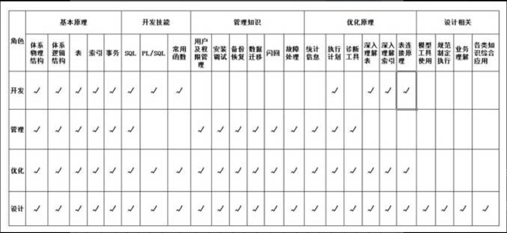

## 第2章 震惊，体验物理体系之旅
**体系结构组成：**

Oracle体系结构图：
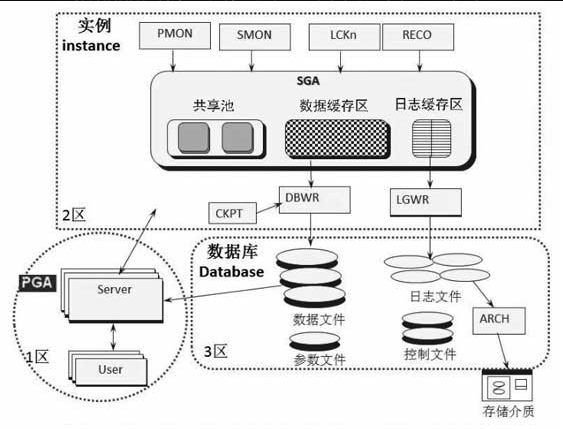
1. Oracle由**实例**和**数据库**组成。
2. 实例是由一个共享内存区SGA(System Global Area)和一系列后台进程组成。
   1. SGA主要包括：**共享池**（shared pool）、**数据缓存区**（db cache）和**日志缓存区**（log buffer）三类。
   2. 后台进程：PMON、SMON、LCKn、RECO、CKPT、DBWn、LGWR、ARCH等系列进程。
3. 数据库是由数据文件、参数文件、日志文件、控制文件、归档日志文件等一系列文件组成的，其中归档日志最终可能会被转移到新的存储介质中，用于备份恢复使用。
4. 另一块内存区为PGA（Program Global Area）区，和SGA最明显的区别在于，它是非共享内存。用户对数据库发起的无论查询还是更新的任何操作，都先在PGA进行预处理，然后才进入实例区域，由SGA和后台进程共同完成。PGA的作用主要有以下三点：
   1. 保存**用户的连接信息**，如会话属性、绑定变量等。
   2. 保存**用户权限**等重要信息，当用户进程和数据库建立会话时，系统会将这个用户的相关权限查询出来，然后保存在这个会话区内。
   3. 当发起的指令需要排序的时候，PGA作为**排序区**，如果内存不足，则超出的部分在临时表空间（属于磁盘）完成排序。PGA排序速度 > 临时表空间排序。

**用户请求处理顺序：**
- 查询语句：
  - 首次查询：PGA -> Instance -> Database
  - 二次查询：PGA -> Instance （由数据缓存区返回数据）
- 更新语句：PGA -> Instance -> Database

**SQL执行经历 - 查询语句**
>执行SQL: `select * from t where id = 1`的过程

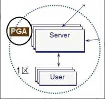

1. PGA
   
    `从磁盘中查找当前用户的连接信息和权限信息`

  -  保存用户的连接信息和权限，作用是只要当前会话不断开连接，下次系统不用再去硬盘中读取数据，而直接从PGA内存区中获取。
  - 生成该SQL指令对应的唯一hash值（身份证）

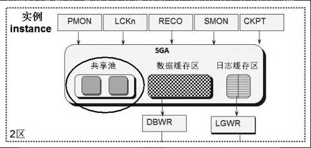

2. SGA - 共享池

    `查询是否有存储过该SQL指令的hash值`
- 如果没有，代表近期没有执行过，则要做几件事情。
  - **检查语法、语义以及是否有权限**，没有问题就存储该SQL指令的hash值。
  - **解析**：判断各种索引读和全表扫描**谁更高效**，代价(Cost)低的被选择作为**执行计划**，并**立即存储**起来，与之前存储过的hash值对应。接着将执行计划告知**数据缓存区**。
- 如果有，代表近期执行过，直接将执行计划告知**数据缓存区**。 
3. SGA - 数据缓存区
   
    `查找id=1的数据`
   - 缓存区有：则直接返回数据。
   - 缓存区没有：则去数据库的数据文件区查找数据并**保留到缓存区**。

4. Database - 数据库的数据文件区（二次执行时跳过该步）
   - 读取数据返回给数据缓存区，此处产生**物理读**（disk read）

**疑问：**
- Oracle 会选择代价最低的一种执行计划，方法是分别尝试一下，比较出高低，但是又不是真正执行，这是怎么做到的啊，准确吗？接下来分晓。

**试验：**
- set autotrace on 是开始跟踪SQL指令的执行计划和执行的统计信息
- set timing on 是表示跟踪该语句执行完成的时间。


试验结果：同一条SQL第2次执行更快且没有物理读和递归调用，逻辑读大幅减少。

原因剖析：
1. 避免**物理读**：用户首次执行该SQL指令时，该指令从磁盘中获取用户连接信息和相关权限信息，并保存在PGA内存里。当用户再次执行该指令时，由于SESSION之前未被断开重连，**连接信息**和相关**权限信息**就可以从PGA内存中直接获取，避免了物理读。
2. 避免**检查**和**解析**：首次执行后，SGA内存区的共享池里已经保存了该SQL指令唯一的hash值，并保留了**语法语义检查**及**执行计划**等相关解析动作的劳动成果，当再次执行该SQL指令时，由于该SQL指令的hash值和共享池里保存的相匹配，所以之前的硬解析动作无须再做，不仅跳过了相关语法语义检查，对于该选取哪种执行计划也无须考虑，直接拿来就好。
3. 避免**物理读**: 首次执行后数据保存在SGA的数据缓存区里，再次执行可以直接从数据缓存区里获取，无需再读磁盘。

**故事类比**
> 《顾客的尺寸》讲述了小余首次丈量顾客衣服尺寸时将尺寸记录下来，等下次遇到同一顾客时就直接快速查出该顾客的衣服尺寸，从而无须每次重复做这个丈量的动作的故事，这不是和**共享池**一模一样嘛，缓存避免了再次解析这个耗时的动作。

> 《有效的调整》中小余把顾客经常购买的服装款式放到最显眼、方便获取的大厅前排货柜里。在整个大厅寻找和在前排货柜寻找的差异类似于**数据缓存区**查找数据和磁盘查找数据的差异！

三个疑惑：SGA区的日志缓存区没描述；后台进程的功能都没提及；Database区数据库文件之外的其他组件也没有提及。

因为之前讲述的是查询语句，接下来介绍更新语句！

**SQL执行经历 - 更新语句**
>执行SQL: `update t set id = 2 where id = 1`的过程

1. PGA
   
    `从磁盘或内存中查找当前用户的连接信息和权限信息`


2. SGA - 共享池

    `查找执行计划或者检查、解析、生成执行计划`
3. SGA - 数据缓存区
   
    `在数据缓存区中查找id=1的数据，没有就去数据库的数据文件读取到数据缓存区中。注意：首次执行的数据也是被读取到数据缓存区中的。`

4. Database - 数据库的数据文件区（二次执行时跳过该步）
   - 读取数据返回给数据缓存区，此处产生**物理读**（disk read）


5. DBWn进程（DBWriter）
   
    `数据缓存区内修改完数据后，会启用DBWn进程，完成更新的数据从内存中刷入磁盘，将磁盘中的id=1的值更新为2。`

    
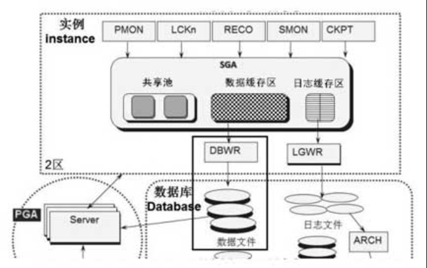
    
6. 日志缓存区 -> LGWR进程（LogWriter） -> 日志文件（磁盘）
   
    `日志缓存区保存了数据库相关操作的日志，记录了这个动作，然后由 LGWR后台进程将其从日志缓存区这个内存区写进磁盘的日志文件里。`
    
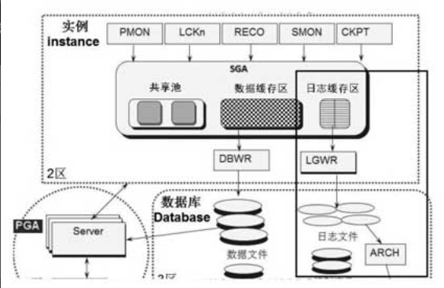

7. ARCH文件（Archive）和ARCn进程（Archiver）

`假设日志文件有4个，按1到4的顺序写，4个都写满后就会重写第1个，重写前ARCn进程（n是数字，表示有多个ARC进程，如ARC1,ARC2,ARC3）会把文件先备份出去，命名为ARCH文件。另外这些ARCH文件也需要定时转移到新的存储介质中，将来数据库故障时可以恢复数据。`

> 一条更新语句无论插入、修改还是删除，最终执行完毕后都需要执行用户做提交COMMIT或回滚ROLLBACK的确认。当发起提交命令后，数据缓存区中的数据一定会立即被DBWn进程写进磁盘吗?

**COMMIT后影响了什么**

- COMMIT无法左右数据何时从数据缓存区刷入数据区，而是Oracle观察缓存区中的数据积累到一定的程度，再批量刷入磁盘中，因为这样高效得多。
- COMMIT时日志缓存区会把要操作的动作写到磁盘的日志文件里，这样Oracle就不一定非要将数据从数据缓存区写到磁盘了。磁盘中的日志文件不是内存中的日志缓存区，会永久保存的，不怕断电，断电后可以依据磁盘里的日志文件重新操作一次，把数据缓存区丢失的数据恢复。

**数据缓存区中的数据是否批量越大越好呢？**

批量刷出的量比较小，Oracle性能就会降低，但是断电开机恢复的时间就较短；反之，批量刷出的量比较大，Oracle 性能是更高了，但是断电开机恢复的时间也较长。

**后台进程CKPT（Check Point）**
>什么时候将数据缓存区中的数据写到磁盘的动作正是由进程CKPT来触发的，CKPT触发DBWn写出。


这是一个相当重要的进程，我们可以通过设置某参数来控制CKPT的触发时间，比如万一出现数据库崩溃，希望Oracle的SMON最多用多长时间来做实例恢复，该参数就是FAST START MTTR TARGET，通过调整该参数，Oracle会调配CKPT在适当的时候去调用DBWn……当然，这个参数也并非越小越好，太小的数值会导致Oracle性能降低.

**语句执行完毕后，如果一直不提交，最终会从数据缓存区刷进磁盘吗？**
>会，因为DBWn将数据缓存区中的数据写到磁盘，不是由COMMIT决定的，而是由CKPT进程决定的。

**劳模评选**


- PMON：含义为Processes Monitor，是进程监视器。如果你在执行某些更新语句，未提交时进程崩溃了，这时候PMON会自动回滚该操作，无须人工去执行ROLLBACK命令。除此之外它还可以干预后台进程，比如RECO出现异常失败了，此时PMON会重启RECO进程，如果遇到LGWR进程失败这样的严重问题，PMON会做出中止实例这个激烈的动作，用于防止数据错乱。
- SMON：含义为System Monitor，可理解为系统监视器。与PMON不同的是，SMON关注的是系统级的操作而非单个进程，工作重点在于实例恢复，除此之外还有清理临时表空间、清理回滚段表空间、合并空闲空间等功能。
- LCKn：含义为Locker，仅用于RAC数据库，最多可有10个进程（LCK0,LCK1,…,LCK9），用于实例间的封锁。
- RECO：含义为Distributed Database Recovery，用于分布式数据库的恢复，适用于两阶段提交的应用场景。这里我简单描述一下，比如我们面临多个数据库A、B、C，某个应用跨越三个数据库，在发起的过程中需要A、B、C库都提交成功，事务才会成功，只要有一个失败，就必须全部回滚。这和LCKn一样，适用的场景比较特殊。
- CKPT：Check Point，由Oracle的FAST_START_MTTR_TARGET参数控制，用于触发DBWn从数据缓存区中写出数据到磁盘。CKPT执行得越频繁，DBWn写出就越频繁，DBWn写出越频繁越不能显示批量特性，性能就越低，但是数据库异常恢复的时间会越短。
- DBWn: DBWriter, 是 Oracle 最核心的进程之一，负责把数据从数据缓存区写到磁盘里，该进程和CKPT相辅相成，因为是CKPT促成DBWn去写的。不过DBWn也和LGWR密切相关，因为DBWn 想将数据缓存区中的数据写到磁盘的时候，必须通知 LGWR 先完成日志缓存区写到磁盘的动作后，方可开工。
- LGWR: LogWriter, 是 Oracle 最核心的进程之一，作用是把日志缓存区中的数据从内存写到磁盘的REDO文件里，完成创建数据库对象、更新数据等操作过程的记录。这个REDO的记录非同小可，可以用来做数据库的异常恢复，只要保护好了这些 REDO 文件和后续对应的归档文件，从理论上来说，即使数据文件被删除了，也可以让数据库根据这些日志记录，把所有的在数据库中曾经发生的事情全部重做一遍，从而保证数据库的安全。
  - 每隔三秒，LGWR运行一次。
  - 任何COMMIT触发LGWR运行一次。
  - DBWn要把数据从数据缓存写到磁盘，触发LGWR运行一次。
  - 日志缓存区满三分之一或记录满1MB，触发LGWR运行一次。
  - 联机日志文件切换也将触发LGWR。
- ARCH：Archiver，它的作用是在LGWR写日志写到需要被覆盖重写的时候，触发ARCH进程去转移日志文件，将日志文件复制出去形成归档日志文件，以免日志丢失。
>今天的劳模评选结束了，恭喜LGWR!

**回滚的研究**

> 前面只是从要提交数据修改的角度去讲SQL执行经历，如果执行SQL后，需要回滚呢？那在执行SQL后准备执行Rollback之前，Oracle如何确保可以顺利执行Rollback操作呢？

1. 跟前面提到的“SQL执行经历 - 更新语句”类似，也要经历PGA的预处理和共享池的检查与解析。
2. 接着要在**回滚表空间**的**相应回滚段事务表**上**分配事务槽**，从而在回滚表空间分配到空间。该动作需要记录日志**写进日志缓存区**。
3. 然后在**数据缓存区**中创建id=1的前镜像，前镜像数据也会写进磁盘的数据文件里（回滚表空间的数据文件），写磁盘的操作由CKPT进程决定。
4. 如果用户**执行提交**，日志缓存区立即要记录这个提交信息，然后就把回滚段事务标记为非激活INACTIVE状态，表示允许重写。
5. 如果用户**执行回滚**，Oracle需要从回滚段中将前镜像id=1的数据读出来，修改数据缓存区，完成回滚。这个过程依然要产生日志，要将数据写进日志缓存区。

> 用于准备回滚的前镜像数据的生成其实和普通数据操作差不多，唯一的差别就在于一个是刷新到磁盘的普通文件里，一个是刷新到磁盘的回滚数据文件里。

**回滚段的相关参数：**


- **undo_management**为AUTO表示是自动进行回滚段管理，回滚段空间不够时可以**自动扩展**；
- **undo_retention** 为900的含义是，DML语句需要记录前镜像，当COMMIT后，表示回滚段保留的前镜像被打上了可以覆盖重新使用的标记，但是要在900秒后方可允许；
- **undo_tablespace**为UNDOTBS1表示回滚段表空间的名字为UNDOTBS1

**哪种DML语句产生的undo最多？**
DML语句一般分为三类，即insert 插入、update 修改和delete 删除，产生的undo大小：删除 > 修改 > 插入，因为**回滚是记录了反向操作的过程**，所以删除需要记录所有字段的前镜像，插入只需要记录rowid，更新需要记录修改前的字段，至少一个及以上。redo则与undo相反，redo记录了正向操作的过程，用作数据恢复。

**回滚段的另一妙用：保证读一致性**
> 书中举了一个例子：4个银行账户互相转账然后查询所有账户总金额。有两种要保证一致读的情况，一种是查询过程中，查到账户3时，账户1向账户4转账了一笔钱，导致账户4金额变多了，而账户1已经查询过，不会再被查询，导致查询出来的总金额可能会变多；另一种是我的转账记录是发生在我查询之前，由另一个人操作的，但是没提交，此时我依然看不到这个转账的变化。导致我查询出来的总金额也可能会发生变化。如何保证查询出来的总金额是正确的呢？

了解一致读原理之前，要了解以下两个知识点：
1. SCN：全称是System Change Number，这是一个只会增加不会减少的递增数字，存在于Oracle的最小单位块里，当某块改变时SCN就会递增。
2. 回滚段记录事务槽：（前面我在描述回滚的时候提过，事务槽是用来分配回滚空间的），如果你更新了某块，事务就被写进事务槽里。如果未提交或者回滚，该块就**存在活动事务**，数据库读到此块可以识别到这种情况的存在。

**读一致性含义**：在一个事务内的多次select结果相同。
- 简单来说就是在某一时刻t1查询数据库，查询过程中即使t2时刻数据有修改，也返回t1时刻的数据。（t2 > t1）
- 又或者在t0时刻别的用户修改了数据但没有提交，t1时刻查询数据库也返回**t0时刻之前**也就是**修改前**的数据。（t1 > t0）

**读一致性原理**

要弄清楚什么时候读普通数据，什么时候读回滚段的前镜像数据。

- 读普通数据：当发起查询的SCN**大于**当前查询块的SCN**且**当前块**没有活动事务**时读普通数据。
- 读前镜像数据：当发起查询的SCN**小于**当前查询块的SCN**或者**当前块**有活动事务**时读前镜像数据。

> 早期的SQL Server的数据库版本，是读产生锁，在读数据时表就被锁住，这样确实是不存在问题了，不过如果读表会把表锁住，那数据库的并发也就做得太糟糕了。早期的其他数据库版本也有边读边锁的，比如已经读过的记录就允许被修改，而未读过的数据却是被锁住的，不允许修改，这虽然稍稍有些改进，只锁了部分表而非全部，但是还是读产生锁，非常糟糕。而 Oracle 的回滚段，解决了读一致性的问题，又避免了锁，大大增强了数据库并发操作的能力。

**内存的体会**

```SQL
//以下命令查看SGA及PGA的大小分配
show parameter sga
show parameter pga
```
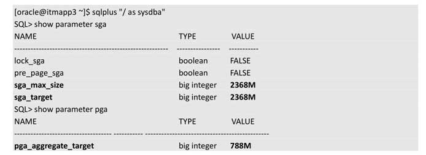

```SQL
//以下命令查看共享池和数据缓存区的大小分配
show parameter shared_pool_size
show parameter db_cache_size
//查看日志缓存区的大小
show parameter log_buffer
```

### 进程的体会

`Oracle数据库是由实例和一组数据库文件组成的，实例则是由Oracle开辟的内存区和一组后台进程组成的。`
```SQL
//查看实例名称
show parameter instance_name
//查看实例的进程
ps -ef | grep 实例名
//查看oracle相关的进程
ps -ef | grep oracle
```

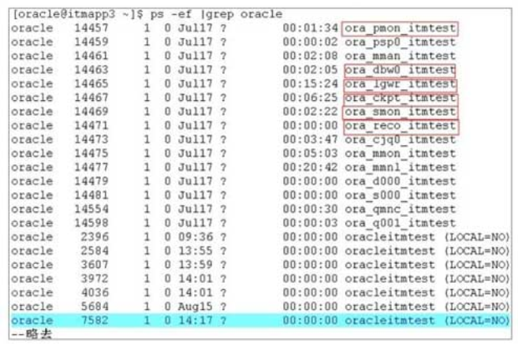

### 启停的体会

- 数据库的启动可分为三个阶段，分别是nomount、mount和open。
- 在启动的过程中可以直接输入startup启动，也可以分成startup nomount、startup mount和alter database open三步分别启动。

**三个阶段：**

1. startup nomount阶段: Oracle必须读取到数据库的参数文件（pfile或者spfile），如果读不到该参数文件，数据库根本无法nomount成功！如果读到参数文件，将完成一件非常重要的事，就是根据参数文件中的内存分配策略分配相应的内存区域，并启动相应的后台进程，换言之，就是创建实例instance。
2. startup mount阶段：实例已经创建了，Oracle继续根据参数文件中描述的控制文件的名称及位置，去查找控制文件，一旦查找到立即锁定该控制文件。控制文件里记录了数据库中的数据文件、日志文件、检查点信息等非常重要的信息，所以Oracle成功锁定控制文件，就为后续读取操作这些文件打下了基础，锁定控制文件成功就表示数据库mount成功，为实例和数据库之间桥梁的搭建打下了基础。
3. alter database open阶段：根据控制文件记录的信息，定位到数据库文件、日志文件等，从而正式打通了实例和数据库之间的桥梁。

> 总结一下，nomount阶段仅需一个参数文件即可成功，mount阶段要能够正常读取到控制文件才能成功，而open阶段需要保证所有的数据文件与日志文件和控制文件里记录的名称和位置一致，能被锁定访问更新的同时还要保证没有损坏，否则数据库的open阶段就不可能成功。

### 文件的体会

> 没有参数文件，无法创建实例，数据库无法 nomount 成功；没有控制文件，数据库无法mount；没有数据文件，数据库无法打开使用（此外没有了数据文件，数据也没地方保存了，数据库也失去意义了）；没有日志和归档文件，数据库就失去了保护伞，变得很不安全。因此所有这些文件都非常重要。

```SQL
// 参数文件位置
show parameter spfile
// 控制文件位置
show parameter control
// 数据文件位置
select file_name from dba_data_files;
// 日志文件位置
select group#, member from v$logfile;
// 归档文件位置
show parameter recovery
// 告警日志文件（位于bdump目录下，以alert开头的文件）
show parameter dump
```

### 2.3 体系学习让SQL语句性能提升千倍

**简单总结物理体系结构知识：**
- PGA内存区：（1）保存连接信息和权限信息；（2）**进行排序操作**。
- SGA的共享池：保存解析过程，避免二次解析。
- SGA的数据缓存区：保存数据，避免二次物理读。
- 日志切换：日志文件写完要循环写时，要先备份到归档文件。

学习以上知识好像没什么用？实则不然~

> 假如某数据库是一个很大的数据库，数据量庞大，访问量非常高，而共享池却非常小，那会怎么样？共享池肯定很快就被放满了，缓存的东西要不断地被挤出，结果很多 SQL 语句都难以避免硬解析，因为很快被挤出共享池消失得无影无踪了，于是整个数据库开始运行缓慢。

解决方法：加大共享池！如果是自动管理模式，就是加大SGA的大小！

> 再比如说，某主机总共才4GB 内存，而运行在其平台上的数据库是一个几乎没有什么访问量的小数据库，可能100MB的共享池就足够了，却被开辟了3GB的SGA内存，500MB的PGA内存。但是由于操作系统内存不足，导致主机运行缓慢，从而导致数据库运行缓慢，怎么办？

解决方法：减少SGA的大小！

> 那如果由于数据缓存区过小导致大数据量的数据库产生大量的物理读，怎么办？

解决方法：在SGA自动管理的情况下，加大SGA的大小，也等同于加大了数据缓存区的大小，这样数据缓存区够大，装的东西就多，物理读自然就减少了，性能自然就提高了。

> 如果一个尺寸很大的排序由于内存无法装下要在磁盘中进行，而操作系统却闲置着大量的内存未使用，**排序速度很慢**，怎么办？

解决方法：增加PGA的大小，争取容纳下排序的尺寸，从而避免物理排序。

> 如果主机的内存不足，而某特定数据库几乎没有什么排序的应用，应该如何做？

解决方法：减小PGA，腾出占用的内存分配给操作系统使用。

> 假如一个数据库系统存在大量的更新操作，产生了大量的日志需要从Redo Buffer中写出到日志文件，由于日志文件写满后要切换到下一个，导致日志频繁地切换，我们之前学过更新数据之前要先写redo日志，预防突然断电，于是日志切换花费的大量时间就等于数据更新流程要等待大量时间，导致更新缓慢，这时候怎么办？

解决方法：增大日志文件的大小，从而降低因写满而切换的频率。

> 现在某应用系统因为查询老出ORA-01555错误返回不了结果给下一个模块使用，导致生产出现故障了，怎么办？

解决方法：该错误（01555-Snapshot too old）是oracle为了保证一致读，宁愿报错也不读错。只要检查这个语句为什么执行这么慢，让它执行得快一点就不容易被更新直至覆盖重写了（可以加索引，或者删除一些表记录，还可以`增大undo_retention的取值，比如写一个很大的时间，让回滚段在这段时间内都不允许被覆盖重写`）。
这里要注意一点，undo_retention只是参考保留时间并非强制，除非另外设置undo表空间的Retention Guarantee属性，使之强制保留。此外也可考虑`增加undo表空间的大小`。

#### 插入数据优化之旅，单车到飞船

> 插入十万条数据的速度统计。

#### 未优化前，单车速度，耗时42秒。
```SQL
create or replace procedure proc1
as
begin
    for i in 1 .. 100000
    loop
        execute immediate
        'insert into t values ('||i||');
    commit;
    end loop;
end;
/
```

分析慢的原因：通过查看v$sql表，发现该表中有十万条SQL记录及对应的hash值，代表这个存储过程执行的SQL被解析了十万次

#### 绑定变量，摩托速度，耗时8秒。
```SQL
create or replace procedure proc2
as
begin
    for i in 1 .. 100000
    loop
        execute immediate
        'insert into t values (:x)' using i;
    commit;
    end loop;
end;
/
```
因为绑定了变量，所以SQL只有一条，只被解析一次，速度就变快了。

#### 静态改写，摩托速度，耗时6秒。
> execute immediate是一种动态SQL的写法，常用于表名和字段名是变量、入参的情况，由于表名都不知道，当然不能直接写 SQL 语句了，所以要靠动态 SQL语句根据传入的表名参数来拼成一条SQL语句，由execute immediate调用执行。但是这里显然不需要多此一举，因为insert into t values（i）完全可以满足需求，表名就是t啊。注意：静态SQL会自动绑定变量。

```SQL
create or replace procedure proc3
as
begin
    for i in 1 .. 100000
    loop
        insert into t values (i);
    commit;
    end loop;
end;
/
```
动态SQL的特点是执行过程中再解析，而静态SQL的特点是编译的过程就解析好了。这点差别就是速度再度提升的原因。

#### 批量提交，动车速度，耗时2秒。

> commit触发LGWR将Redo Buffer写出到Redo Log中，并且将回滚段的活动事务标记为不活动，同时在回滚段中记录对应前镜像记录的所在位置。虽然commit耗费的时间不长，但是执行十万次也相当耗时，所以把commit放到循环外一次性提交可以提高插入速度。

```SQL
create or replace procedure proc4
as
begin
    for i in 1 .. 100000
    loop
        insert into t values (i);
    end loop;
    commit;
end;
/
```

#### 集合写法，飞机速度，耗时0.25秒。
> 为什么会快这么多呢？其实是因为原先的一条一条插入的语句变成了一个集合的概念，变成了整批地写进Data Buffer区里。

```SQL
insert into t select rownum from dual connect by level <=100000;
```

#### 直接路径，火箭速度，耗时0.12秒。
> insert into t select ……的方式是将数据先写到Data Buffer中，然后再刷到磁盘中。而create table t 的方式却是跳过了数据缓存区，直接将数据写进磁盘，这种方式又称为直接路径读写方式，因为原本是数据先到内存，再到磁盘，更改为数据直接到磁盘，少了一个步骤，因而速度提升了许多。
```SQL
create table t as select rownum from dual connect by level <=100000;
```

#### 并行设置，飞船速度，耗时0.04秒。
> 遇到性能好的机器，还是可以大幅度提升性能的。大家看如下语句，设置日志关闭nologging，并且设置parallel 16表示用到机器的16个CPU，速度就会更快。并行最大的缺点就是占用了大多数CPU的资源，如果是一个并发环境，很多应用在运行，因为这个影响了其他应用，导致其他应用资源不足，将引发很多严重问题，所以需要三思而后行，了解清楚该机器是否允许你这样占用大部分资源。
```SQL
create table t nologging parallel 16 as select rownum x from dual connect by level <=100000;
```

### 2.4 走进12c新特性之多租户架构
> **大楼里的江湖争斗:** 从前，有一座大楼，里面有几家公司，每家公司都有自己的办公室，大家各自经营各自的业务，相安无事。有一天，A公司和B公司员工忽然暴打起来，原因是B公司觉得A公司用电太多导致B公司电力不足，大楼管理员安抚了半天也没起到什么作用。没几天，又有战事，员工人数不多的C公司，一家独占了好几个大房间（闲暇时大家就地举行羽毛球比赛），而员工人数众多的D公司，却只拥有一个小小的房间（伸个懒腰就能击倒两人），于是D公司提出要C公司让出点位置给D公司，可C公司以未来业务发展需要为由不同意。最后，身中两刀的大楼管理员被迫辞职了。大楼内继续上演着江湖恩仇录，刀光剑影、血雨腥风。直到有一天，有一家海外跨国大企业 E公司的老板出现在大楼里，一切都改变了。你们干什么干什么，那个谁谁谁，把这边的几个断手断脚的都拿去扔了，看着不吓人吗？把你们的领导都叫出来在大厅集合，我要收购你们。霸气的5分钟训话后，这个大楼升起了一面大旗，上面写着三个字，E公司。这里所有的公司都成为E公司的分公司了，被E公司接管了。从此，A公司用电再也不会过多，D公司的员工也再不拥挤，原来的死对头们现在不但没有打打杀杀，还统一穿着打上E公司LOGO的服装，手牵手唱着《因为我们是一家人》，不过胸牌上的文字还是能看出他们来自不同的部门。听说江湖巨变，大楼管理员屁颠屁颠地回来了，这里不但没有打打杀杀，工作量也大幅减轻了。原来繁杂的大楼人员情况收集、房租水电、财务细节再也不烦琐了，因为E公司会统一给出一个详细的报告，再也不用冒着生命危险一家一家公司去了解了。

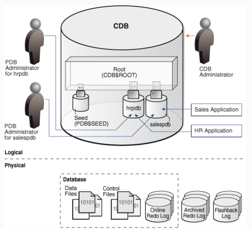
#### 多租户架构组成

1. Root：又名CDB\$ROOT，用来存储Oracle提供的metadata和common user。metadata的一个例子是Oracle提供的PL/SQL包的源代码。common user 指的是一个所有容器都知道的数据库用户（注意，当我们想在数据库中创建用户的时候，一般是不能往ROOT中创建的。需要先通过语句alter session set container=PDB's name 转换到相应名称的PDB下再创建用户，要想详细了解关于common user 和 local user的区别，请参考Oracle 官方文档Oracle Database Security Guide）。一个CDB只能有一个根。
2. Seed：又名PDB$SEED，用来创建新的PDB模板。但是，不能在Seed里添加或者修改对象，一个CDB只能有一个Seed。
3. PDB：全称为Pluggable Database，中文翻译为可插拔数据库。PDB展现给用户和应用的形象就像是一个没有CDB的普通数据库，比如hrpdb salespdb等。一个PDB包括支持一个特定应用程序所需的所有数据和代码。PDB 完全向后兼容Oracle 12c之前版本的所有数据库。
4. CDB：以上的每个组成部分都被称为容器（container）,Root、Seed、PDB都是容器。CDB就是接管这个容器的数据库。这些容器在CDB中都有它们自己唯一的容器ID和名称。我们可以很轻松地向 CDB 中插入一个PDB 或者从 CDB 中拔出一个PDB。当将一个PDB 插入CDB中时，相当于将这个PDB与CDB连接起来，反之则解除关系。

> 现在结合之前说的故事，大家就能完全理解了。这里的CDB就是E公司，而PDB就是之前打打杀杀后被收购的各公司。这个Seed我们可以理解为E公司专门成立了一个部门，用来实施快速复制业务的需求，比如根据A公司的规模快速复制一个A公司，无论场地大小、设施等都完全一样，以便开发新的市场，而这个Root则可以理解为为各个分公司提供公共服务的部门，比如水、电、茶等。

注意：原书中只是提及了没有应用程序容器的CDB，想要完全了解CDB还是要查看Oracle官方文档[CDB 和 PDB](https://docs.oracle.com/en/database/oracle/oracle-database/21/cncpt/CDBs-and-PDBs.html#GUID-5C339A60-2163-4ECE-B7A9-4D67D3D894FB)。

#### 多租户架构的好处
- 省资源（PGA和SGA共用一套，消耗内存少）
- 增加资源使用率（可以随意增加各种数据库）
- 管理方便（可以轻松管理各个PDB，通过CDB即可完成，可以统一启停数据库）
- 迁移方便（从这个CDB到那个CDB可轻松完成）

## 第3章 神奇，走进逻辑体系世界  

### 3.1 长幼有序的逻辑体系
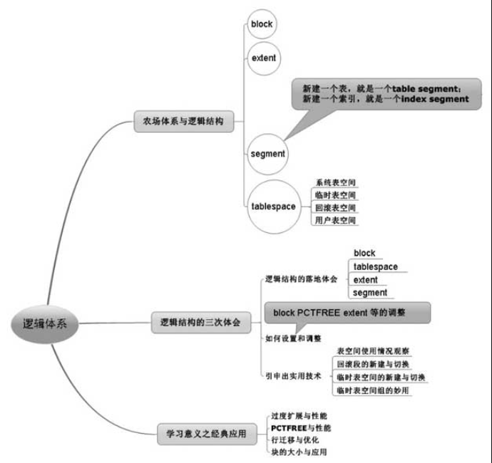

### 3.2 逻辑体系从老余养殖细细说起
> 物理体系是看得见摸得着的，如数据文件、参数文件、控制文件、日志文件、归档文件等等，而逻辑体系则是在`数据文件`的基础上抽象出来的。
> 
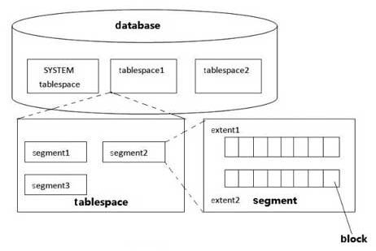  
逻辑结构组成：表空间（tablespace）、段（segment）、区（extent）、块（block）  
> 书中养殖场的例子提到如下对应关系：
> - 数据库：九峰山养殖场
> - 表空间：老黄、老林等养殖户（养殖爱好不同）
> - 段：猪圈、牛圈、羊圈（表、索引）
> - 区：每次扩展的面积（一次80平米，高效扩展空间）
> - 块：最小养殖面积（8平米，刚好养4头猪或2头牛，高效利用空间）
从图中不难看出，数据库（database）由若干**表空间**组成，表空间由若干**段**组成，段由若干**区**组成，区又是由Oracle的最小单元**块**组成的。  
其中表空间又包含**系统表空间**、**回滚段表空间**、**临时表空间**、**用户表空间**。除了用户表空间外，其他三种表空间有各自特定的用途，不可随意更改和破坏，尤其是系统表空间更是需要被小心谨慎地保护。  
一个database要想存在，至少需要有系统表空间及回滚段(undo)表空间。  
> Oracle的这个区的设计是为了避免过度扩展，因为块的尺寸太小了，如果以块为单位进行扩展，那就好比您在故事里说的每次以8平方米为单位进行猪圈扩建一样，估计Oracle数据库也要像老余那样被累病倒了。  

> 总结一下，王财主心目中的8平方米是他的最小核算单元，类似Oracle中的最小单位数据块；小余建议的80平方米类似 Oracle 中的区的概念；这些猪圈、牛圈、羊圈其实就是段；这些牲畜组成的这个养殖场就是表空间；而老黄、老林、老张等其他养殖户的养殖场就是不同的表空间，他们共同组成的九峰山养殖场家园就是数据库。

#### 块

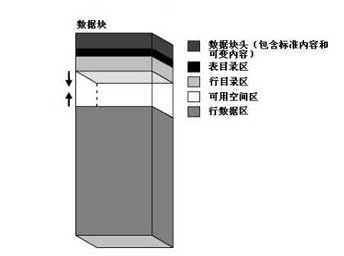

数据块分成5个部分：
1. 数据块头：包含了此数据块的概要信息，例如块地址（block address）及此数据块所属的段的类型（比如到底是表还是索引）。
2. 表目录区：只要有一行数据插入到数据块中，那该行数据所在的表的信息将被存储在这个区域。
3. 行目录区：存放你插入的行的地址。
4. 可用空间区：就是块中的空余空间，这个空余的多少由Oracle的PCTFREE参数设置，如果是10，表示该块将会空余10%左右的空间。此外，如果是表或者索引块，该区域还会存储事务条目，大致有23字节左右的开销。
5. 行数据区：存储的是具体的行的信息或者索引的信息，这部分占用了数据块绝大部分的空间。  
其中数据块头、表目录区、行目录区被统称为**管理开销（overhead）**
> 小故事加深印象：猪圈里的每个小房间类似Oracle 中的数据块。比如你到了猪圈的某个小房间门前，你在门口就能看到门牌（标注了这个房间所在的位置，如九峰山农场老余养殖场猪圈6号房），还可以看到标注了此房养了2头猪（1黑1白）的信息。同时还可以知道这两头猪的位置（一头在房间的左边，一头在右边），如果你推门进去，发现果然有2头猪。此外发现房间有一点空间预留着。

#### 区和段  
> 只要segment创建成功，数据库就一定为其分配了包含若干数据块的初始数据扩展（initial extent），即便此时表中还没有数据，但是这些初始数据扩展中的数据块已经为即将插入的数据做好准备了，接下来向T表（也就是segment T）中插入数据，很快初始数据扩展中的数据块就都装满了，而且又有新数据插入需要空间，此时 Oracle 会自动为这个段分配一个新增数据扩展（incremental extent），这个新增数据扩展是一个段中已有数据扩展之后分配的后续数据扩展，容量大于或等于之前的数据扩展。  
每个段的定义中都包含了数据扩展的存储参数（storage parameter）。存储参数适用于各种类型的段。这个参数控制着Oracle如何为段分配可用空间。例如，用户可以在CREATE TABLE语句中使用STORAGE子句设定存储参数，决定创建表时为其数据段分配多少初始空间，或限定一个表最多可以包含多少数据扩展。如果用户没有为表设定存储参数，那么表在创建时使用所在表空间（tablespace）的默认存储参数。  
在一个本地管理的表空间中（注，还有一种数据字典管理的表空间，因为是一种要被淘汰的技术，这里就不提及了），其中所分配的数据扩展的容量既可以是用户设定的固定值，也可以是由系统自动决定的可变值。取决于用户创建tablespace时用 UNIFORM 指令（固定大小）还是AUTOALLOCATE指令（由系统管理）。

- 对于固定容量（UNIFORM）的数据扩展，用户可以为数据扩展设定容量（比如100MB、1GB等随你设定）或使用默认大小（1 MB）。用户必须确保每个数据扩展的容量至少能包含5个数据块。本地管理（locally managed）的临时表空间（temporary tablespace）在分配数据扩展时只能使用此种方式。  
- 对于由系统管理（AUTOALLOCATE）的数据扩展，你就无从插手干预了，Oracle或许一个区申请20MB，下一个区忽然申请100MB,Oracle在运行过程中自行决定新增数据扩展的最佳容量，你无从得知规律。不过还是有一个下限的，即区的扩展过程中其最小容量不能低于64KB，假如数据块容量大于或等于16 KB，这个下限将从64KB转变为1 MB。

#### 表空间
- 系统表空间：存储各个表空间所需要的信息
- 临时表空间：存储中间信息，断开session后自动删除
- 回滚表空间：存储回滚信息
- 数据表空间：存储数据

#### 逻辑结构初体会

```SQL
//查看块大小的两种方法
show parameter db_block_size
select block_size from dba_tablespaces where tablespace_name='SYSTEM';
//查看数据表空间、系统表空间、回滚表空间
select * from dba_data_files where tablespace_name = '表空间名称'
//查看临时表空间
select * from dba_temp_files where tablespace_name = '表空间名称'
//查看区
select * from user_extents where segment_name ='表名或者索引名';
//查看段
select * from user_segments where segment_name ='表名或者索引名';
```
#### 逻辑结构二次体会
```SQL
//创建表空间时设置块的大小为16K
create tablespace TBS blocksize 16K datafile '数据文件名';
//创建表空间时设置区的大小为10M
create tablespace TBS uniform 10M datafile '数据文件名';
//查看临时表空间
select * from dba_temp_files where tablespace_name = '表空间名称'
//查看区
select * from user_extents where segment_name ='表名或者索引名';
//查看段
select * from user_segments where segment_name ='表名或者索引名';
```

#### 逻辑结构之三次体会

##### 查看已用和未用的表空间
```SQL
//查看剩余表空间
select sum(bytes)/1024/1024 from dba_free_space
where tablespace_name = '表空间名字';
//查看表空间总大小
select sum(bytes)/1024/1024 from dba_data_files
where tablespace_name = '表空间名字';
```

##### 回滚表空间的新建与切换
建多个回滚段的目的是可以瘦身，原先的回滚段一直扩展导致空间浪费太多，新建出来的小一点，切换成功后删除原来旧的回滚表空间，磁盘空间就空余出来了。

##### 3.2.7.5 临时表空间组及其妙用
> Oracle可以为**不同的用户**指定不同的临时表空间从而减缓IO竞争，实际上在Oracle 10g以后推出的临时表空间组，可以做到`自动`为**同一用户的不同SESSION**设置不同的临时表空间，这可以说在缓解IO竞争方面再次迈出了大大的一步！  
```SQL
//查询临时表空间组里的所有临时表空间
select * from dba_tablespace_groups
```
总结：临时表空间组的推出，可以让我们往表空间组里不断新增临时表空间，让数据库在运行时自动从临时表空间组中选择各个临时表空间，不只是用户层面，而且是在SESSION 层面进行IO均衡负载，极大地提升了数据库的性能。

### 3.3 课程结束你给程序安上了翅膀

#### 3.1 过度扩展与性能
> 如果某个表（或者说某段）中的记录增长得特别快，就可以考虑把这个区的大小设置得大一点，比如将initial extent和incremental extent都设置得比较大，这样申请扩展区的次数就会减少，性能可以提高。

但其实最影响性能的还是创建表空间时分配的初始空间大小，因为初始的表空间大小越大，在这个初始表空间内能装下更多的区，申请扩展表空间的次数就会减少，其中申请扩展表空间是最耗时的，因为要把操作系统的文件格式化为数据库能识别的表空间。  
如果空间已经足够大，其中的段申请扩展区，那都是可以识别的格式，无须格式化动作，所以就不耗时。  
因此我们在创建表空间时，需要预先规划好表空间的大小，如果段的扩展导致表空间不够而需要表空间去扩大，那开销是很大的，但是如果预先分配过多，也是一种浪费，需要我们根据实际应用去平衡。

##### 3.2 PCTFREE与性能
PCTFREE代表块的预留空间，PCTFREE = 10 代表每个块有10%的预留空间，为将来的update或alter操作留空间，默认为10。如果PCTFREE过小，将来修改行记录的字段值或字段长度时，会发生过多的行迁移，导致数据库的I/O性能下降。  
我们可以根据数据库对表更新的频繁程度对表的PCTFREE做设置，免得产生行迁移，影响性能  
可以对单个表或段的PCTFREE参数进行设置。

#### 3.3.3 行迁移与优化
如何发现表存在大量行迁移?
```SQL
//查看单表有多少行发生迁移
select count(1) from chained_rows where table_name='表名';
//检查所有表是否存在行迁移的脚本
select 'analyze table '||table_name||' list chained rows into chained_rows;' from user_tables;
```

#### 3.3.4 块的大小与应用
OLAP系统：并发少，返回数据量大，主要走全表扫描，块尽量大
OLTP系统：并发多，返回数据量小，主要走索引读，块尽量小  
块越大，全表扫描时读的块数量就越少，速度越快。但是容易导致大量并发查询及更新操作都指向同一个数据块，从而产生热点块竞争。（多个用户读同一个块）
块的大小一般对索引读性能没有什么影响，因为索引读最后只读目标块并返回少量数据。

## 第4章 祝贺，表的设计成就英雄
### 4.1 表的设计之五朵金花
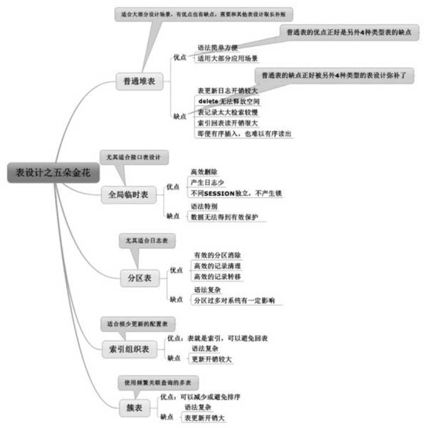

### 4.2 表的特性从老余一家展开描述

#### 4.2.2 普通堆表的不足之处

普通堆表的不足之处：
- 表更新有日志开销（可在适当场合选择`全局临时表`）
- 表delete操作有瑕疵（可在适当场合考虑全局`临时表`或`分区表`）
- 标记路太大检索较慢（可在适当场合选择`分区表`）
- 索引回表读开销很大（可在适当场合选择`索引组织表`）
- 有序插入难有序读出（可在适当场合选择`簇表`）

> 虽然普通表可以实现大部分功能，但是这里说的是功能，而不是性能。‘表设计’这一章，我们主要就是强调什么场合该选择什么技术，而这句话本身就告诉我们，没有最高级的技术，只有最适合的技术。


##### 4.2.2.1 表更新日志开销较大
> 对表的更新操作，无论是删除、插入还是修改，都会产生日志。虽说安全第一，不过在某些特定的场合，某些表的记录只是作为中间结果临时运算而根本无须永久保留，这些表无须写日志，那就既高效又安全了！

公布之前redo排名的问题：删除最多。因为删除产生的undo最多，而undo也是需要redo保护的，所以虽然本身产生的redo不多，但是由于删除时的undo量最大，用于保护undo的redo量也最大，所以加在一起，删除产生的redo也就可能最多了。  
**结论：delete产生的redo和undo都最多，最耗性能。**

##### 4.2.2.2 delete无法释放空间
**小实验：**
> delete前后分别select一下数据，发现逻辑读次数一样，很奇怪。而truncate操作则不会。

原因：delete 删除并不能释放空间，虽然delete将很多块的记录删除了，但是空块依然保留，Oracle在查询时依然会去查询这些空块。而truncate是一种释放高水平位的动作，这些空块被回收，空间也被释放了。

**生动例子：**
> 好比我来到XX大楼统计里面的人数，我从1楼找到20楼，每层的房间都打开去检查了一下，发现实际情况是一个人都没有。我很后悔自己累得半死却得出没人的结论。但问题是，你不打开房间，怎么知道没人呢，这就类似 delete 后剩余空块的情况。而与truncate有些类似的生动例子就是，我想统计XX大楼里的人数，结果发现，XX大楼被铲平了，什么房间都没有了，于是我飞快地得出结论，XX大楼里没有人。  

不过truncate显然不能替代delete，因为truncate是一种DDL操作而非DML操作，truncate后面是不能带条件的（也就是不能加where）。  
但是Oracle是支持在分区表中做truncate分区的，命令大致为 `alter table t truncate partition '分区名'`  

这是分区表最实用的功能之一，**高效地清理数据，释放空间**。

注意：当大量delete再大量insert时，Oracle会去这些delete的空块中首先完成插入（直接路径插入除外），所以频繁delete又频繁insert的应用，是不会出现空块过多的情况的，这点大家要知道，不能草木皆兵。

##### 4.2.2.3 表记录太多检索较慢
有没有什么好方法能提升检索的速度呢？  
Oracle 为了尽可能减少访问路径提供了两种主要技术，一种是**索引技术**，另一种则是**分区技术**。  
**索引**  
如果created>=xxx and created <=xxx返回的记录非常少，或者说和T表的总记录相比非常少，则在created列建索引能极大提升该语句的效率。

**分区**  
减少访问路径的第二种技术就是**分区**。我们把普通表T改造为分区表，以created 这个时间列为分区字段，从2010年1月到2012年12月按月建36个分区。早先的T表就有一个T段，现在情况发生了变化，`从1个大段分解成了36个小段`，分别存储了2010年1月到2012年12月的信息。此时假如created>=xxx and created <=xxx 这个时间跨度正好落在2012年11月，那Oracle的检索只要完成一个小段的遍历即可，假设这36个小段比较均匀，我们可大致将其理解为访问量只有原来的三十六分之一，大幅减少了访问路径，从而高效地提升了性能。

这就是分区表，除了之前描述的具有高效清理数据的功能外，还有**减少访问路径**的神奇本领。

##### 4.2.2.4 索引回表读开销很大
> 一般来说，根据索引来检索记录，会有一个先从索引中找到记录，再根据索引列上的ROWID定位到表中从而返回索引列以外的其他列的动作，这就是`TABLE ACCESS BY INDEX ROWID`。一般是先`INDEX RANGE SCAN`读索引再`TABLE ACCESS BY INDEX ROWID`回表。

##### 4.2.2.5 有序插入却难有序读出
> 插入数据后delete会产生空块，再插入会优先占用空块，则无法保证有序。（除非每次delete的都是最新插入的一条数据。）

这导致要使用order by排序进行数据的读取。  
如何避免order by会执行排序呢？ 
1、在order by的列建索引。2、将普通表改造为有序散列聚簇表，可以保证顺序插入。  
第一种方法是因为`插入时维护索引会排序`，第二种是保证了`按顺序插入`。

#### 4.2.3 奇特的全局临时表
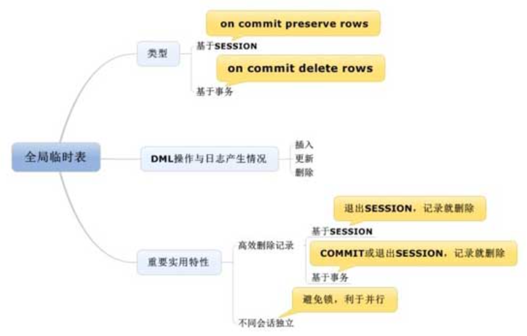

##### 4.2.3.1 分析全局临时表的类型
全局临时表分为两种类型，**一种是基于会话的全局临时表（on commit preserve rows），一种是基于事务的全局临时表（on commit delete rows）**

建表语法如下：
```SQL
create global temporary table T_TMP_session on commit preserve rows as select * from dba_objects where 1=2;

create global temporary table T_TMP_transaction on commit delete rows as select * from dba_objects where 1=2;
```
##### 4.2.3.2 观察各类DML的redo量
实验略。  
结论：**无论插入、更新还是删除，操作普通表产生的日志都比全局临时表要多。**

##### 4.2.3.3 全局临时表的两大重要特性

1. **高效删除记录。** 基于**事务**的全局临时表 COMMIT 或者 SESSION 连接退出后，临时表记录自动删除；基于**会话**的全局临时表则是SESSION连接退出后，临时表记录自动删除，都无须我们手动去操作。
2. 针对不同session数据独立，不同的session访问全局临时表，看到的结果不同。

**基于会话和基于事务的全局临时表的区别**  
基于会话的全局临时表COMMIT后数据不会删除，而基于事务的会删除。

**一般来说，基于会话的全局临时表的应用会更多一些，少数比较复杂的应用，涉及一次调用中需要清空记录再插入等复杂动作时，才考虑用基于事务的全局临时表。**

#### 4.2.4 神通广大的分区表
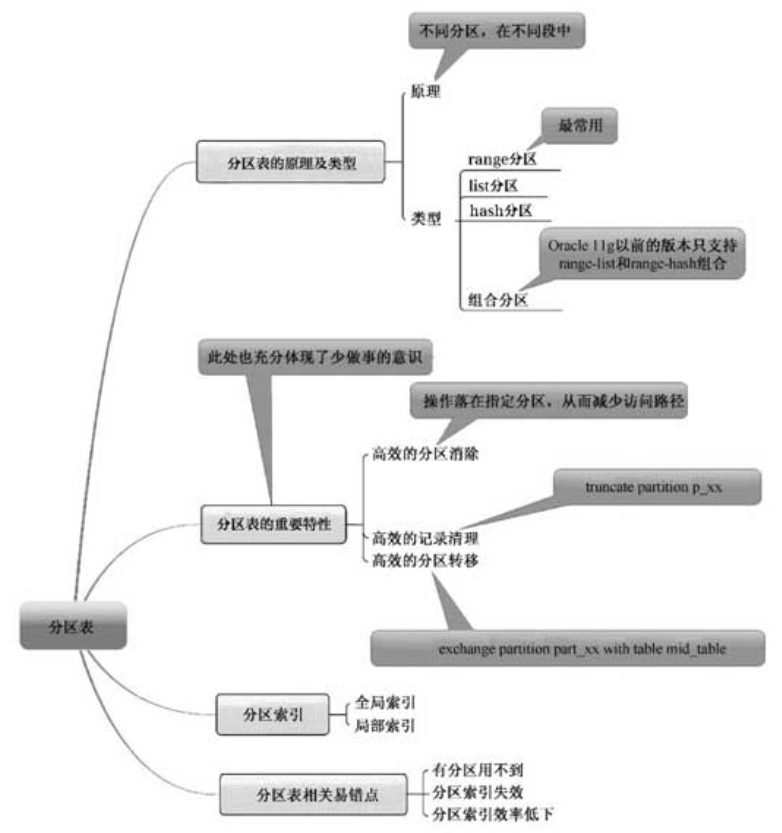

##### 4.2.4.1 分区表的类型及原理

分区表的类型有**范围分区、列表分区、HASH分区及组合分区**4种，其中**范围分区**应用最为广泛，需要重点学习和掌握。其次是列表分区，最少用的是HASH分区。

**1.范围分区**  
范围分区最常见的是按时间分区。语法如下：
```SQL
create table t (id number, deal_date date)
        partition by range(deal_date)
        (
          partition p1 values less than (to_date('2020-01-01', 'YYYY-MM-DD')),
          partition p2 values less than (to_date('2021-01-01', 'YYYY-MM-DD')),
          partition p3 values less than (to_date('2022-01-01', 'YYYY-MM-DD')),
          partition p_max values less than(maxvalue)
        );
```
注意：  
1. 范围分区的关键字为partition by range，即这三个关键字表示该分区为范围分区。
2. values less than是范围分区特定的语法，用于指明具体的范围，比如partition p2 values less than（TO_DATE（＇2012-03-01＇,＇YYYY-MM-DD＇）），表示小于3月份的记录。
3. partition p1 到partition p_max表示总共建立了4个分区。
4. 最后还要注意partition p_max values less than（maxvalue）的部分，表示超出这些范围的记录全部落在这个分区中，免得出错。
5. 分区表中的分区可分别指定在不同的表空间里，如果不写即为都在同一默认表空间里。

**2. 列表分区**  
其实就按某一列的值进行分区，语法略。

**3. 散列分区**  
很少用，语法略。

**4. 组合分区**  
前面三种的结合，语法略。

**5.分区原理**  
分区其实就是分段，原先一个表对应一个段，变成一个表对应多个段（分区）。  
注意：分区表也是有额外开销的，如果分区数量过多，Oracle 就需要管理过多的段，在操作分区表时也容易引发Oracle内部大量的递归调用，此外，本身的语法也有一定的复杂度。所以一般来说，只有大表才建议建分区，记录数在100万以下的表，基本不建议建分区。

##### 4.2.4.2 分区表最实用的特性
**1.高效的分区消除**  
分区表存在的最大意义在于，可以有效地做到分区消除，比如你对地区号做了分区，查询福州就只会在福州的分区中查找数据，而不会到厦门、漳州、泉州等其他分区中查找，这就是分区消除，消除了福州以外的所有其他分区。也就是从查大表变成了查小表（分区）。

**2.强大的分区操作**  
**（1）分区truncate好快捷**  
分区清理的方法，在有大量历史数据需要清理的时候，发挥着极其重要的作用。很多历史表、日志表都被设计为分区表，正是由于这个特性使得清理数据极其方便迅速，而且能有效释放空间。  
**（2）分区数据转移很神奇**  
**分区交换**，可以实现**普通表**和**分区表的某个分区**之间**数据的相互交换**，它们之间的交换非常快，基本上瞬间就可以完成，实际上只是Oracle在内部数据字典中做的一些小改动而已。命令很简单，类似：alter table 分区表 exchange partition 分区名 with table中间表。  
**（3）分区切割你想分就分**    
**（4）分区合并你想合就合**  
**（5）分区增与删非常简单**  

##### 4.2.4.3 分区索引类型简述
**1.全局索引**：跟普通索引一样。  
**2.局部索引**：每个分区自己的索引。  
在`user_ind_partitions`表可以查到每个局部索引。 在`user_indexes`表可以查到全局索引和局部索引，局部索引的status为N/A。

##### 4.2.4.4 分区表之相关陷阱
1.索引缘何频频失效  
可以通过查看上面两张表观察索引的status是否失效。  
truncate、分区转移、切割、合并、增删等操作需要使用`update global indexes`关键字，从而避免全局索引失效。

2.有索引效率反而更低  
如果在分区表上查询时没有用到分区条件，则查询效率比没有分区更慢。所以分区表设计要考虑在语句中有效用到分区条件，有无分区条件差别巨大

#### 4.2.5 有趣的索引组织表
> **普通表**查询索引以外的列时，需要**回表**，而**索引组织表**不用。

**索引组织表**最大的特点就是，表就是索引，索引就是表，这是一种很特别的设计，所以无须访问表。不过这种设计的表的更新要比普通表开销更大。因为表要和索引一样有序地排列，更新负担将会非常重。**因此这种设计一般适用在很少更新、频繁读取的应用场合，比如地区配置表，这种表中的数据一般很少变动，却有大量读取。**

#### 4.2.6 簇表的介绍及应用
> 普通表还有一点缺陷，就是order by语句中的排序不可避免，而簇表可以避免排序。

簇表在创建时会用`cluster`关键字指定哪些列会映射到簇，具体可以看[这篇文章](http://blog.itpub.net/26736162/viewspace-2140737/)。。

### 4.3 理解表设计的你将成为项目组英雄
> 项目瓶颈：有一个业务数据要先存到T0表，然后再做相应处理后存到T1、T2表，最后需要删除T0表，整个过程速度很慢。

解决方法：把T0表设置为`基于事务的全局临时表`，不用手动delete数据，`直接Commit就会自动删除数据`，同时由于临时表会根据不同session显示不同内容，也给`设置并行度`提供了条件。

### 4.4 走进12c新特性之分片技术
**垂直切分**  
对于有海量数据的数据库，如果是因为表多而数据多，这时候适合使用垂直切分，即把关系紧密（比如同一模块）的表切分出来放在一个服务器上。垂直切分的最大特点就是规则简单，实施也更为方便，尤其适合各业务之间的耦合度非常低、相互影响很小、业务逻辑非常清晰的系统。在这种系统中，可以很容易做到将不同业务模块所使用的表拆分到不同的数据库中。根据不同的表来进行拆分，对应用程序的影响也更小，拆分规则也会比较简单清晰，这就是所谓的share nothing。  
**水平切分**  
如果数据海量不是因为表多，而就是因为数据量大，这时就适合进行水平切分，将同一个表中的不同数据拆分到不同的数据库中，这就是**分片技术**。简单来说，Oracle 的分片技术就是通过分区技术的扩展来实现的。以前一个表的分区可以存在于不同的表空间中，现在可以存在于不同的数据库中。**不同分区存在于不同数据库**，这就将数据隔离了开来，并且还可以**用到不同数据库主机的资源**，不过相对水平切分来说，垂直切分会更复杂一些。   
现实中往往是两种方式的结合，**先做垂直切分，再做水平切分**。  

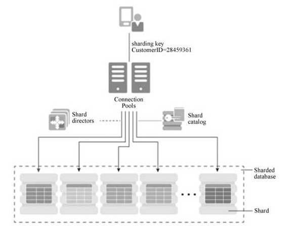
Oracle中的分片技术主要包括下面这些组件：  
**Sharded database（SDB）**：逻辑上SDB是一个数据库，但是物理上SDB包括多个物理独立的数据库，SDB类似一个数据库池，数据库池中包括多个数据库（Shard）。目前的版本最大支持1000个Shard。  
**Shard**:SDB包括多个物理独立的数据库，每一个数据库都称为Shard，每个Shard数据库位于不同的服务器上，它们不共享CPU、内存、存储等资源。每个Shard数据库中保存表的不同数据集，但是每个Shard中都有相同的列。Shard数据库可以是Dataguard/ADG，提供高可用性，Shard数据库（单机或者ADG）可以通过GSM deploy来自动创建，也可以将一个已经通过dbca创建好的数据库添加到SDB。  
**Shard catalog**：这是一个Oracle数据库，用于集中存储管理SDB的配置信息，是SDB的核心。SDB配置变化，比如添加/删除shard、Global service等，都记录在Shard catalog中。如果应用查询多个 Shard 中的数据，那么由 Shard catalog 统一协调分配。我们推荐将 Shard catalog配置为Dataguard环境，这样可以提供HA高可用性。如果Shard catalog无法访问，那么只会影响一些维护操作和跨Shard访问，而不会影响单独的Shard操作（通过sharding key的查询/DML）。  
**Shard directors**: Global Data Service（GDS）实现对分片的集中部署和管理。GSM是GDS的核心组件。GSM作为Shard director,GSM类似于监听器，将客户端对SDB的请求路由到对应的shard，负载均衡客户端的访问。
> 故事中的6家单位都是Shard，它们合在一起统称为Sharded database,Shard catalog就是故事中老板新设的科研机构，负责公平分摊各种生产任务。而Shard directors是干什么的呢？可以将其理解为是一个对外的窗口，负责接收并处理外部的各种客户请求，有效地传递给公司内部去处理。听起来，Shard catalog对内，而Shard directors对外。

## 第5章 惊叹，索引天地妙不可言

### 5.1 看似简单无趣的索引知识
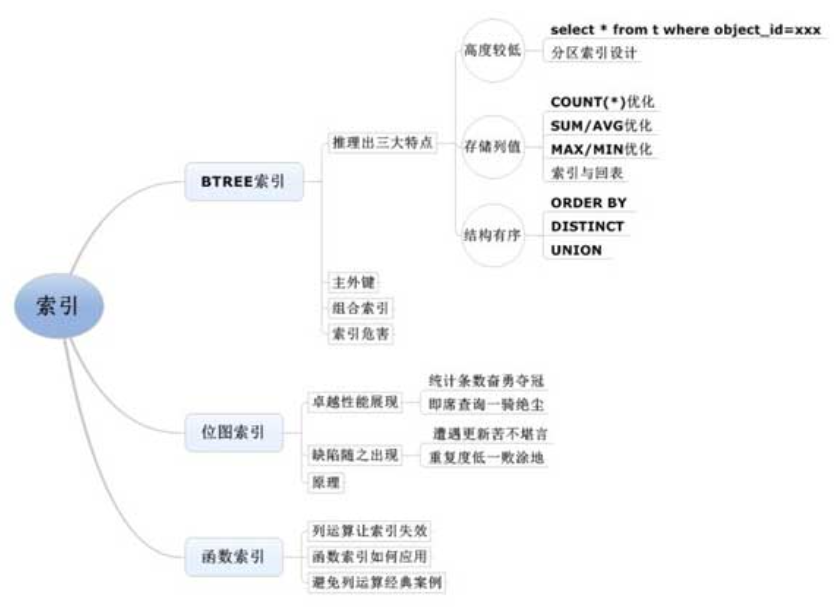

### 5.2 索引探秘从小余缉凶拉开帷幕
#### 5.2.1 BTREE索引的精彩世界
##### 5.2.1.1 BTREE索引结构图展现
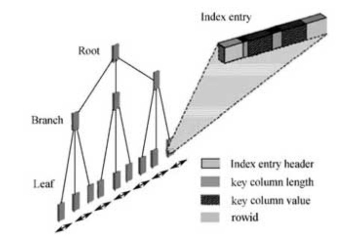
索引结构图说明索引是由Root（根块）、Branch（茎块）和Leaf（叶子块）三部分组成的，其中Leaf（叶子块）主要存储了key column value（索引列具体值），以及能具体定位到数据块所在位置的rowid（注意区分索引块和数据块）

>select * from t where id=12;，该t表的记录有10 050条，而id=12仅返回1条，在t表的id列上创建了一个索引，索引是如何快速检索到数据的呢，接下来分析这个索引查询示例图：

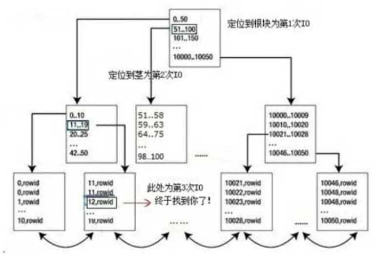

这个查询一共需要4次IO：**1、定位到root。2、定位到branch。3、定位到leaf。4、根据leaf上的rowid定位到数据块中的行（回表）。**

Leaf（叶子块）主要存储key column value（**索引列具体值**）以及能具体定位到数据块所在位置的**rowid**（注意区分索引块和数据块）

##### 5.2.1.2 索引是物理结构还是逻辑结构

1.要建索引先排序：从小到大获取索引列记录及行rowid并存入内存。  
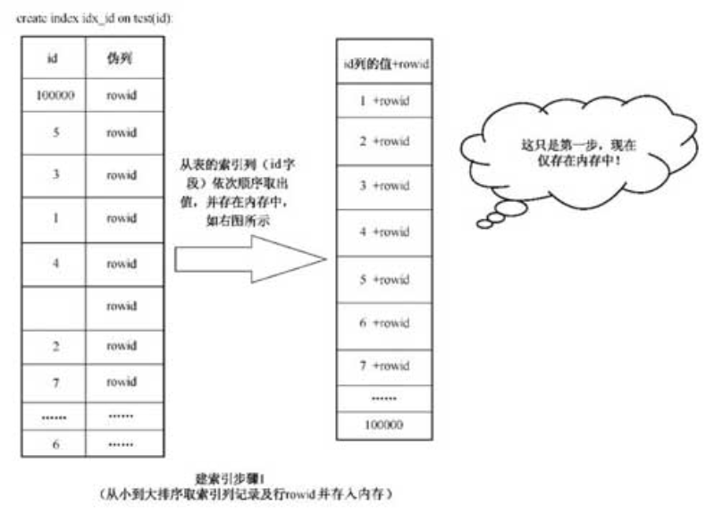
2.列值入块成索引：把**索引列值+rowid**按顺序存放到**块**中。  

3.填满一块接一块：填满第一个块后，继续填第二个块。
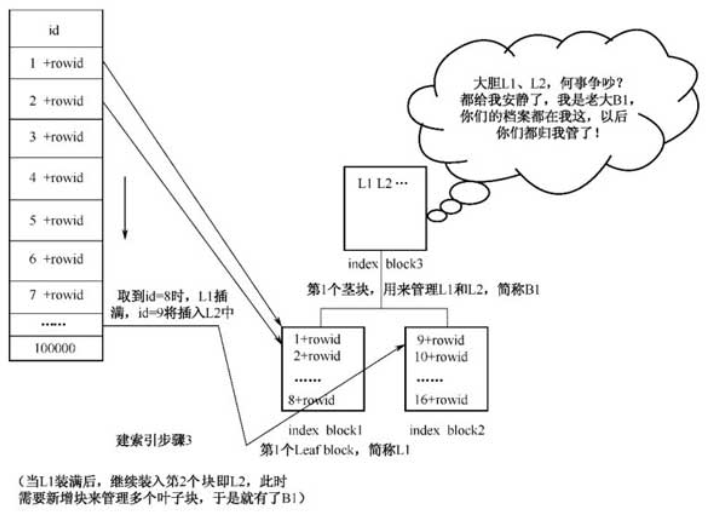
4.同级两块需人管：由于块有多个，所以需要建一个branch（茎）对叶子块进行管理。当branch也有两个的时候，则需要更上一层的块进行管理，也就是root（根）。这里只演示高度为3的索引结构，实际根上还可能会有上级管理块。
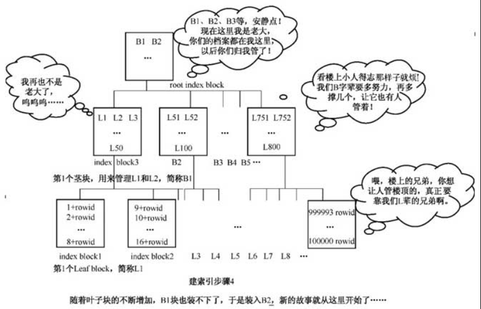

所以综上所述，**索引是逻辑结构**。

##### 5.2.1.3 索引结构的三大重要特点
**1.索引高度较低**  
作者说见过最大的一张表有500GB，有几百亿条记录，但是该表上某列索引的高度才不过6层而已。   
**2.索引存储列值**  
**3.索引本身有序**  
在B树的逻辑结构中，**索引列值是从左到右依次增大的**。  
##### 5.2.1.4 插播小余缉凶精彩故事
略

##### 5.2.1.5 妙用三特征之高度较低

**1.索引高度较低验证**  
`user_ind_statistics`表的`BLEVEL`列可以查看索引的高度，0表示第一个块还没有装满。
**2.妙用索引高度较低的特性**  
- 查询1条或少量数据时，大表的小表的IO次数相差不大，速度也差不多。
- 查询100万条或大量数据时，查一条记录需要3-4次IO，乘以100万就是三四百万次IO，比全表扫描还要慢。
- 全表扫描还有一个优势，就是一次可以读取多个块，不仅是一次读取一个块，这样IO的次数还可以大大降下来。
- 不一定是表的记录数量越多，全表扫描就越慢，而是要结合字段数去看，字段数越多，单行记录占用的块空间就越大，整体占用的块数就更多，当块数非常多的时候，全表扫描就会很慢。但如果行记录数很多，而字段数很少，占用的块很少，那么全表扫描和索引读的速度差距不大。

**3.分区索引设计误区**  
>分区表的索引分为两种，一种是局部索引，一种是全局索引。局部索引等同于为每个分区段建分区的索引，从user_segment 的数据字典中，我们可以观察到表有多少个分区，就有多少个分区索引的段

普通索引读：遍历一个索引，3-4次IO。  
分区索引读：遍历多个分区的索引，（3/4 x 分区数）次IO，这是在没有加分区条件，需要遍历多个分区的情况下。

**如果设置了分区索引，但是却用不到分区条件，性能将继续下降。如果你建了分区索引，但是无法加上分区字段的条件，那建议不要建分区索引。**


#### 5.2.1.6 巧用三特征之存储列值
**1.COUNT（*）优化**  
由于索引只存放索引列和rowid，所以索引块比数据块的数量少很多，count(*)读取的块数（IO）也就少了。  
注意：如果索引列可以为null，则查询时需要加非空条件，否则索引失效。不过一般业务表都会有主键，也就不会有这个问题。

**2.SUM/AVG优化**  
SUM/AVG跟count(*)一样，注意加非空条件即可避免索引失效。

**3.MAX/MIN优化**  
MAX/MIN不用加非空条件也可以使索引生效。

**MAX/MIN的惊天秘密** 
**INDEX FULL SCAN**: MAX/MIN会用到这种算法，其实就是直接读取索引结构B树的最左边的块或者最右边的块即可。  
**INDEX FAST FULL SCAN**：count(*)会用到的算法，就是从左往右读取所有的索引块。  
**INDEX RANGE SCAN**：根据索引的列值进行3-4次IO，最终定位指定的块。

**MAX/MIN的性能陷阱**  
`select min(id),max(id) from t`：用了全表扫描  
加上非空条件，用了**INDEX FAST FULL SCAN**  
原因：同时使用min和max会导致**INDEX RANGE SCAN**算法失效。  
解决方法：使用**子查询优化**。
```SQL
select max, min from (select max(id) max from t) a, (select min(id) min from t) b
```

**4.索引回表与优化**  
（1）你确定查询需要返回所有字段吗  
**索引回表读（TABLE ACCESS BY INDEX ROWID）**
> 作者经历的优化案例中，消除TABLE ACCESS BY INDEX ROWID 这个回表动作改进性能的案例占比达20%左右，相当常见。

（2）索引不含查询列可考虑组合索引  
联合索引列不宜过多，一般超过3个字段组成的联合索引都是不合适的。

（3）聚合因子决定了回表查询的速度
> 实际上，回表查询的速度也是有差异的，这里引出一个重要概念叫**聚合因子**。

**聚合因子**：表明有多少个临近的索引条目指到不同的数据块。一般来说，表的插入顺序和索引列的顺序越接近，聚合因子就越小。如果聚合因子很小，10行索引条目可以全部在数据块 B 块中被完整地找到。相反就要去读很多个块。

**优化方案**：如果某列的读取频率远高于其他列，那就保证表的排列顺序和这列一致，按照这列的顺序，**重组一下表记录**来优化即可。

##### 5.2.1.7 活用三特征之索引有序
**1.order by排序优化**  
排序算法有些特别，内部的机制导致性能和逻辑读关系不是太大，主要消耗在CPU性能上，开销极大。此外，如果PGA区无法容纳下排序的尺寸而进入磁盘排序，那将成为更大的性能杀手。  
可以在需要排序的列上使用索引来避免排序，但是注意如果**返回大量数据**的话，可能还是排序的cost更小一些，因为索引的IO很大，交给Oracle的解析器去判断哪个更好了。

**2.distinct排重优化**  
使用distinct时会发生排序操作，也可以使用索引来避免排序。  
>不过现实中，distinct语句靠索引来优化往往收效是不明显的，因为大多数情况用到distinct都是因为表记录有重复，因此我们首先要考虑为什么重复，后面我会给大家上优化思想课程，里面就有类似的案例。

**3.索引全扫与快速全扫**  
为什么`INDEX FAST FULL SCAN`会比`INDEX FULL SCAN`更快，那是因为索引快速全扫描一次读取多个索引块，而索引全扫描一次只读取一个块。  
一次读取多个块不容易保证有序，而一次读取一个块可以保证有序，因此在有排序的场合，`INDEX FULL SCAN`的顺序读可以让排序消除，`INDEX FAST FULL SCAN`虽然减少了逻辑读，但是排序这个动作却无法消除。

所以说，COUNT（*）和SUM之类的统计根本无须使用排序，一般都走INDEX FAST FULL SCAN，而涉及排序语句时，就要开始权衡利弊，也许使用INDEX FAST FULL SCAN更快，也许使用INDEX FULL SCAN更快。

INDEX FULL SCAN：每次读一块，可消除排序，但逻辑读多。
INDEX FAST FULL SCAN：每次读多块，不可消除排序，但逻辑读少。

**4.UNION合并的优化**  
UNION合并结果时会去重，而去重需要排序。

在某些业务场景下，两个表根本就不可能有重复，却用UNION而不用UNION-ALL，这时我们要做的事情就是，**将UNION修改为UNION ALL**。

##### 5.2.1.8 不可不说的主外键设计
主外键有三大特点：第一，主键本身是一种索引；第二，可以保证表中主键所在列的唯一性；第三，可以有效地限制外键依赖的表的记录的完整性。

1.外键上的索引与性能

2.外键索引与锁的避免  
在外键上建索引还能有效避免锁的竞争

3.主外键约束简单证明  
外键所在表的外键列取值必须在主表中的主键列有记录。

4.级联删除操作很方便
`ON DELETE CASCADE`关键字可以实现级联删除，也就是删除主表的记录也会自动删除外键关联表的对应记录。

##### 5.2.1.9 组合索引高效设计要领
**1.适当的场合能避免回表**  
**2.组合列字段越少越高效**  
**3.组合两列谁在前更合适**  
在等值查询的情况下，组合索引的列无论哪一列在前，性能都一样。  
组合索引的两列，当一列是范围查询，一列是等值查询的情况下，**等值查询列在前，范围查询列在后**，这样的索引才最高效！  
**4.哪列在前更合适原理探讨**  
略  
**5.组合查询 in的经典改写**  
一些整数的范围查询，可以转化为in，如>=20 and <=21  
**6.设计需考虑单列的查询**  
如果单列的查询列和联合索引的前置列一样，那单列可以不建索引，直接利用联合索引来进行检索数据。

##### 5.2.1.10 变换角度看索引的危害
**1.索引越多插入明显越慢**  
**2.无序插入索引影响更惊人**  
**3.修改删除与插入略有差别**  
如果表中经常要更新绝大部分记录，此时索引就失去了快速检索的用途，那这种索引还是赶紧删了的好。

如果某张表中建了过多的索引，删除语句实际上是更新了所有的索引。而不同于update语句，更新哪一列影响哪一个索引，所以索引过多对delete的影响显然大于对update的影响。

**索引过多对三种更新语句的影响**  
1、对insert语句影响最大。
2、对delete语句有好有坏，海量数据中定位删除一条数据是好的，但是如果索引过多或者删除过多数据时，就不好了。
3、对update语句影响最小，因为一般只影响到修改列的索引。

**4.建索引动作引发排序及锁**  
建索引的过程会产生锁，而且不是行级锁，**是把整个表锁住，任何该表的DML操作都将被阻止**。

##### 5.2.1.11 如何合理控制索引数量

`v$index_usage_info`表查看索引使用情况。

**逻辑读和物理读**  
当会话所需要的数据在内存的Buffer Cache中找不到，此时就要去磁盘上的数据文件中读取，这样就产生了物理读（Physical Reads），即物理读是从磁盘文件把需要的数据读入内存（SGA中的Buffer Cache）。  
逻辑读（Logical Reads）表示CPU需要的数据在内存中被找到，数据被直接从内存中传入CPU执行，即逻辑读是从内存中读取。在Oracle中，逻辑读 = 即时读（又叫当前读，Current Read）+一致性读（Consistent Read），在“SET AUTOTRACE ON”中，逻辑读=db block gets（当前读）+consistent gets（一致性读）。即时读就是读取数据块当前的最新数据。任何时候在Buffer Cache中都只有一份当前数据块。即时读通常发生在对数据进行修改，删除操作时。这时，后台进程会给相关数据加上行级锁，并且标识数据为“脏数据”。  
物理读过大表现为磁盘I/O较高，逻辑读过大表现为CPU使用率过高。

#### 5.2.2 位图索引的玫瑰花之刺
##### 5.2.2.1 统计条数奋勇夺冠

```SQL
create bitmap index inx_bitm_status on (status)
```
**COUNT（*）的性能，在非空列有BTREE索引的情况下，该索引的性能远高于全表扫描。不过性能最高的是列上有位图索引的情况，比用到普通非空列的BTREE索引时的性能又高出一大截！**

不用索引：cost：10733，consistent gets：48871  
普通索引：cost：1874，consistent gets： 8330  
位图索引：cost：88，consistent gets： 95  

**注意：位图索引可以存储空值。**

##### 5.2.2.2 即席查询一骑绝尘
>在人口普查中，经常需要做一些关于性别、年龄范围、出生地等多维度的分析统计，这类多维度的报表查询（如select * from t where col1=xxx and col2=xxx and col3=xxxx and col4=xxx…），我们称之为即席查询。

不用索引：cost：124  
联合索引：cost：39960 （该表有五个字段，联合索引有三个字段，所以联合索引读还不如全表扫描）  
位图索引：cost：11  

##### 5.2.2.3 遭遇更新苦不堪言

>某SESSION插入该表的记录是男，任何其他SESSION和男有关的记录都不可能插入成功。 

对于位图索引列，插入了某个列值而不commit，则该列值锁住，其他session不能再插入该列值。  
所以索引列的值如果大部分都是重复的，那么几乎只能单线程做DML操作，不支持高并发。

##### 5.2.2.4 重复度低一败涂地
位图索引的使用场景要满足`两个条件`：**第一，位图索引列大量重复；第二，该表极少更新。**

如果对id列建位图索引，则count(*)的cost非常高，比全秒扫描还要高很多。

##### 5.2.2.5 了解结构真相大白
配图：男女NULL的填表图  
配图：毕业在读填表  

图中的0和1是比特值，BTREE 索引存储的是**列值**，而位图索引存储的是**比特位值**。假如位图索引所在的列只有一个取值，比如SEX性别列只有男，这时整个位图索引的大小大致等于行数乘以这1字节，如果性别有男和女，至多也就是只有男的情况下的两倍大，所以位图索引在重复度很低时，体积非常小，所以COUNT（*）统计非常快

#### 5.2.3 小心函数索引，步步陷阱
##### 5.2.3.1 列运算让索引失去作用
>select * from t where upper（object_name）=＇T＇;对索引列做运算会让普通索引失效。

##### 5.2.3.2 函数索引是这样应用的
>create index idx_upper_obj_name on t（upper（object_name））;

**函数索引的性能介于普通索引和全表扫描之间。**  
**重要**：对列进行函数运算的SQL语句的写法都是可以转换成对列不做运算的普通写法。下节揭晓。

##### 5.2.3.3 避免列运算的经典案例

经典案例1：  
原来写法：select * from t where object_id-变量1<=变量2  
改进写法：select * from t where object_id<=变量2+变量1  

经典案例2：  
原来写法：select * from t where substr(name,1,4)='CLUS'  
改进写法：select * from t where name like '%CLUS%'  

经典案例3：  
原来写法：select * from t where trunc(createdTime)>=TO_DATE('2012-10-02','YYYY-MM-DD')
and trunc(createdTime)<=TO_DATE('2012-10-03','YYYY-MM-DD')  
改进写法：select * from t where createdTime >= TO_DATE('2012-10-02','YYYY-MM-DD')
and createdTime < TO_DATE('2012-10-02','YYYY-MM-DD')+1  

### 5.3 索引让一系列最熟悉的SQL语句飞起来了
没有实质内容，跳过

### 5.4 走进12c新特性之索引优化  
**同时建多个类型的索引**  
在Oracle 12c中，一个列可以同时建多个不同类型的索引（BTREE, bitmap，函数索引），不过在某个时刻只能用一个类型，方法就是先建一个在用的，再建其他类型的索引并用invisible关键字来声明，如果想用的时候就用visible来声明。原来要更改列的索引类型，必须把已有的索引先删除再新建，这个开销就非常大了，甚至涉及长时间地停止应用，现在完全不需要了。

**可选择部分分区建索引**  
Oracle 12c 无论是 global 还是 local都可以有选择地对部分分区创建索引，语法是在表、分区或子分区级别设置[INDEXING { ON |OFF }]。这样，如果查询条件确定的分区无索引，那直接走全表扫描；如果查询条件可以确定的分区范围内有索引，会直接使用索引（无论是local还是gLobal）；如果查询条件未确定分区范围（含索引和无索引分区情况），那该 SQL 语句会在有索引的分区使用索引，在没有索引的区域走全表扫描。

## 第6章 经典，表的连接学以致用

### 6.1 表的连接之江南三剑客
配图

### 6.2 三大类型从小余跳舞一一道来
#### 6.2.1 跳舞也能跳出连接类型
##### 6.2.1.1 感觉怪异的嵌套循环
书中例子：开始跳舞时先从男孩子中选出一名，然后进到女孩子所在的房间，找到高度合适的女孩子，一起到大厅中跳舞。第二对照此操作，从男孩子所在的房间再选一名，再进入女孩子所在的房间，匹配到高度适合的女孩子。

##### 6.2.1.2 排序合并及散列连接
书中例子：男孩子在房间中进行排序，个子最矮的小余被排在了第一位。而另一间女孩子所在的房间，也做了类似的事情，最后两个房间的人都依次按顺序走到舞池大厅，依据高对高、矮对矮的原则配对，完成了舞池配对。

散列连接不算排序，由 PGA 中的HASH_AREA_SIZE参数来控制，而排序合并连接则是由PGA中的SORT_AREA_SIZE参数控制。

> 在电信、金融等领域的数据库相关应用中，表连接总体的比例情况大致为，嵌套循环连接（Nested Loops Join）占70%左右，而散列连接（Hash Join）占20%，剩下大致10%是排序合并连接（Merge Sort Join）。

为什么呢？  
因为在电信OLTP 系统中，绝大部分的表连接查询都是返回少量的记录，好比只选小余去跳舞而非全部男生一样。

#### 6.2.2 各类连接被访问次数的差异
##### 6.2.2.1 嵌套循环连接的表的被访问次数
```SQL
--select后面应该加/*+ leading(t1) use_nl(t2) */来强制使用nested loop join，这里省略。
--访问t1表1次，访问t2表100次（t1表只有100条记录）
select * from t1,t2 where t1.id = t2.t1_id
--访问t1表1次，访问t2表2次
select * from t1,t2 where t1.id = t2.t1_id
and t1.n in (17,19)
--访问t1表1次，访问t2表1次
select * from t1,t2 where t1.id = t2.t1_id
and t1.n = 19
--访问t1表1次，访问t2表0次
select * from t1,t2 where t1.id = t2.t1_id
and t1.n = 9999999999
```

**t1表的查询返回多少条记录，t2表就被访问多少次**。  
第一次t1表返回100条记录，是因为t1表全表就是100条记录，无条件查询当然就是返回100条；而第二次AND t1.n in（17,19）的条件让t1表返回2条记录，所以t2表被访问2次；第三次AND t1.n=19的条件让t1表的查询只返回1条记录，所以t2表被访问1次；最后一次AND t1.n=999999999这个条件显然是从t1表中查不出任何记录的，所以t2表被访问0次，干脆就不被访问了！

##### 6.2.2.2 散列连接的表被访问的次数
```SQL
--访问t1表1次，访问t2表1次（t1表只有100条记录）
select /*+ leading(t1) use_hash(t2) */ * from t1,t2 where t1.id = t2.t1_id
--访问t1表1次，访问t2表0次
select /*+ leading(t1) use_hash(t2) */ * from t1,t2 where t1.id = t2.t1_id
and t1.n = 9999999999
--访问t1表0次，访问t2表0次
select /*+ leading(t1) use_hash(t2) */ * from t1,t2 where t1.id = t2.t1_id
and 1=2
```
**在散列连接中，驱动表和被驱动表都只会被访问0次或者1次。**

##### 6.2.2.3 排序合并连接的表被访问的次数
```SQL
--访问t1表1次，访问t2表1次（t1表只有100条记录）
select /*+ ordered use_merge(t2) */ * from t1,t2 where t1.id = t2.t1_id
```
**排序合并连接和散列连接是一样的，t1表和t2表都只会被访问0次或者1次。**

**注意：排序合并连接根本就没有驱动和被驱动的概念，而嵌套循环连接和散列连接要考虑驱动和被驱动情况。**

#### 6.2.3 各类连接驱动顺序的区别
##### 6.2.3.1 嵌套循环连接的表驱动顺序
书中例子：t1表作为驱动表被访问的情况下，t2表只被访问了1次。而t2表作为驱动表被访问的情况下，t1表居然被访问了100 000次，这是因为t1表的结果集才返回1条记录，而t2表的结果集返回100 000条记录。

```SQL
--select后面应该加/*+ leading(t1) use_nl(t2) */来强制使用nested loop join，这里省略。
--t1作为驱动表，访问t1表1次，访问t2表1次
select /*+ leading(t1) use_nl(t2) */ * from t1,t2 where t1.id = t2.t1_id and t1.n = 19
--t2作为驱动表，访问t1表1次，访问t2表100000次
select /*+ leading(t2) use_nl(t1) */ * from t1,t2 where t1.id = t2.t1_id
and t1.n = 19
```

**结论：嵌套循环连接要特别注意驱动表的顺序，先访问小的结果集，后访问大的结果集，才能保证被驱动表的被访问次数降到最低，从而提升性能！**

##### 6.2.3.2 散列连接的表驱动顺序
t1表先被访问的情况下Buffers是1013，而t2表先被访问的情况下，Buffers也是1013，但是Used-Mem却差异明显，前者是286KB，后者是11MB，说明排序尺寸差异明显。再结合时间来看，前者是0.04秒，后者是0.1秒，差别也不小。

**结论：说明散列连接中驱动表的顺序非常重要，性能差别也很明显！**

##### 6.2.3.3 排序合并的表驱动顺序
t1表无论是先被访问还是后被访问，效率都一样，排序尺寸一个是2048B+8236KB，另一个是8236KB+2048B，此外执行时间和Buffers都是一样的。

**结论：嵌套循环连接和散列连接有驱动顺序，驱动表的顺序不同将影响表连接的性能，而排序合并连接没有驱动的概念，无论哪张表在前都无妨。**

#### 6.2.4 各类连接排序情况分析
##### 6.2.4.1 除嵌套循环连接外都需排序
在嵌套循环连接的任何一次测试中，都看不到执行计划中出现Used-Mem相关的关键字，而在散列连接和排序合并连接的执行计划中随处可见Used-Mem关键字，说明除了嵌套循环连接不需要排序外，排序合并连接和散列连接都需要排序。

##### 6.2.4.2 排序只需取部分字段

`select t1.id`比`select *`要省空间得多。

##### 6.2.4.3 关于排序的经典案例
执行计划走排序合并连接时：把select *改为select所需字段。

#### 6.2.5 各类连接限制场景对比
##### 6.2.5.1 散列连接的限制
**散列连接不支持不等值连接<>，不支持>和<的连接方式，也不支持LIKE的连接方式。**  

##### 6.2.5.2 排序合并连接的限制
**排序合并连接不支持<>连接条件，也不支持 LIKE 连接条件，但是比起散列连接，它的支持面要广一些，支持>之类的连接条件。**

##### 6.2.5.3 嵌套循环无限制
**嵌套循环就是支持所有的SQL连接条件写法，没有任何限制。**

### 6.3 你动手装备的表连接威震三军
我们先来约定两个术语，一个是连接条件，一个是限制条件。t1.id=t2.t1_id就是连接条件，而t1.n=19和t2.n=5932就是限制条件。

#### 6.3.1 嵌套循环连接与索引
最适合嵌套循环连接的场景如下：  
- ① 两表关联返回的记录不多，最佳情况是驱动表结果集仅返回1条或少量几条记录，而被驱动表仅匹配到1条或少量几条记录，这种情况即便t1表和t2表的记录奇大无比，速度也是非常快的。  
- ② 遇到一些不等值查询导致散列连接和排序合并连接被限制使用，不得不使用嵌套循环连接。

需要使用者提供如下条件：  
- ① 驱动表的限制条件所在的列有索引。(where t1.n = xxx, `n列要有索引`)
- ② 被驱动表的连接条件所在的列有索引。(on t1.t1_id = t2.t2_id, `t2_id列要有索引`)

在驱动表的限制条件上建索引是**为了减少扫描驱动表的时间**，如果在驱动表的连接条件上建索引就没任何意义了，所有列关联到另一张表的所有列，等同于每条记录都要关联。而在驱动表的限制条件上建了索引，只快速返回1条或者几条，然后再等传递给t2表的t2_id列，一般情况下t2表对应t1表的记录返回不多，所以在t2表的t1_id列建索引是有意义的。

t1表传递给t2表后匹配的记录越少，t2表的连接条件的列的索引就越能发挥作用。

#### 6.3.2 散列连接与索引
> 对于散列连接和排序合并连接来说，索引的连接条件起不到快速检索的作用，但是限制条件列如果有适合的索引可以快速检索到少量记录，还是可以提升性能的。

两表关联等值查询，在没有任何索引的情况下，Oracle倾向于走散列连接这种算法，因为散列连接的算法本身是比较高效且先进的。  

散列连接需要在 PGA 中的 HASH_AREA_SIZE中完成，因此增大HASH_ARAE_SIZE也是优化散列连接的一种有效途径，一般在内存自动管理的情况下，我们只要`加大PGA区的大小即可`。

#### 6.3.3 排序合并连接与索引
> 索引对于**嵌套循环**连接来说非常重要，既要考虑驱动表的限制条件上的索引，又要考虑被驱动表的连接条件上的索引；而索引对于**散列连接**来说，仅需考虑限制条件上的索引是否能用上索引，连接条件上的索引是不能发挥作用的；**排序合并连接**和散列连接又有差别，排序合并连接上的连接条件虽然没有检索的作用，却有**消除排序的作用**。

不过Oracle的排序合并连接本身是有缺陷的，我们在连接条件的两个列都建过索引，却**只能消除一张表的排序**。  

但是即便如此，在某些特定的场合下，我们还是可以考虑在排序合并连接场合中，`对连接条件列建索引，以消除一张表的排序，提升效率。`

除此之外，还有一个和散列连接类似的优化思路，就是`增大内存排序区，避免在排序尺寸过大时在磁盘中排序`。

## 第7章 搞定！不靠技术靠菜刀


### 7.1 SQL语句一刀被剁了
有主键的表无需排重。

### 7.2 整个模块丢弃了
去除不需要的模块。

### 7.3 调用次数减少了
从5分钟采集一次到500分钟，跟需求方沟通需求。

### 7.4 排序不再需要了
某系统运行缓慢且一直出现临时表空间不足的相关告警。一般占用临时表空间的SQL语句都是一些带有order by排序的语句。  
  
这里的逻辑是先从T1表取出数据然后插入T2表，但是从T1表取数据的时候无需排序，因为即使排序了，按顺序插入T2表后也不能保证被顺序读出。

### 7.5 大表砍成小表了
有些业务逻辑需要按照某列排序然后取出前二十条数据，这个排序无法避免。怎么办呢？  
根据业务情况分析，可以去除多年前的数据，只保留最近三个月的数据，于是大表就变成的小表，效率就提高了。  

### 7.6 排重操作消失了
> 前一段时间我遇到了一件非常奇怪的事情，某项目组的开发人员编写的 SQL 语句不少都带有distinct排重语句，尤其是针对某些表，比如T表等。这让我有些不解。  
> 这是什么原因呢，该项目组十多个人写的各自不同的SQL语句都带有distinct，难不成T表有重复记录？结果我一查，呆住了，还真是有重复记录。最后和项目组负责人沟通后，彻底无语了。负责人告诉我这个大量重复的T表是外部提供的接口表之一，他们要根据这些接口表的记录，做二次提炼和开发，并输送给下一环节。因为接口表有重复记录，而该表的数据来源又非他所能控制，他也找接口表来源的相关人员反映过情况了，对方暂时无法解决重复记录的问题，所以才无可奈何地在项目组中定下了针对该表的代码必须加distinct排重的规定，所以才看到如此多的语句带distinct。

**解决方法：**  
对这个接口T表做一个改造，比如专门针对T表再建一个中间表T1表。这个T1表其实就是对T表做了排重的表。然后所有语句中的distinct写法就都可以取消了，因为大家的SQL语句操作针对的是T1表而不是T表。

### 7.7 插入阻碍小多了
让插入单纯一点，不要边插入边维护索引。让插入阻碍小了，让插入少做事了，这就是成功的奥妙。  
这里还有一个奥妙，就是索引重建是批量的动作，而边插入边维护索引是单次的动作，批量的性能当然好过单次的性能。

### 7.8 迁移事情不做了
> 某次有相关技术人员来找我，希望能帮忙看看为什么他们在测试环境中迁移数据库一天都无法完成。我查看后发现其实是因为他们想导出的测试库的某用户有200GB那么大，而机器的配置又比较低，最关键的是，他们用的是exp/imp命令，而不是数据泵的expdp/impdp命令，前者只是针对小型数据量的导出导入工具。

他们告诉我，因为测试环境B需要读取测试环境A下的某个用户的一些表，每次都要找测试环境A的相关人员要一些表结构和记录情况，太麻烦了。我有些吃惊地问他们，那导到你们的环境中后，数据不是不实时了吗？他们回答说一般变化不大可以接受，过几个月变化大了，可以再重新导一次。“我更加吃惊了，这种事情居然还要做多次。于是我问他们，既然你们之间的网络是通的，内网的速度是惊人的千兆网，而你们又只是读取他们系统中的表，为什么不建一个数据链来访问他们的表，这样还需要迁移吗，还需要因为不够实时而反复迁移吗？

## 第8章 升级！靠技术改隐形刀


### 8.1 大表等同小表了
改进前：  
```sql
begin
select count(*) into v_cnt from t;
if v_cnt>0
then 逻辑A
else
then 逻辑B
End;
```  
问题：如果v_cnt表无限大，则select语句耗费很多资源。
改进后：加上rownum，只需访问一条数据即可。
```sql
begin
select count(*) into v_cnt from t where rownum = 1;
if v_cnt>0
then 逻辑A
else
then 逻辑B
End;
```  


查看谁占用了undo表空间

select r.name                      回滚段名,
       RSSIZE / 1024 / 1024 / 1024 "ressize(g)",
       s.sid,
       s.SERIAL#,
       s.username,
       s.STATUS,
       s.SQL_HASH_VALUE,
       s.SQL_ADDRESS,
       s.MACHINE,
       s.MODULE,
       substr(s.PROGRAM, 1, 78)    操作程序,
       r.usn,
       HWMSIZE / 1024 / 1024 / 1024,
       SHRINKS,
       XACTS
from sys.V_$SESSION s,
     sys.V_$TRANSACTION t,
     sys.V_$ROLLNAME r,
     V$ROLLSTAT;

查看谁占用了temp表空间
select t.BLOCKS * 16 / 1024 / 1024,
       s.USERNAME,
       s.SCHEMANAME,
       t.TABLESPACE,
       t.SEGTYPE,
       t.EXTENTS,
       s.PROGRAM,
       s.osuser,
       s.TERMINAL,
       s.SID,
       s.SERIAL#,
       sql.SQL_FULLTEXT
from V$SORT_USAGE t,
     V$SESSION s,
     V$SQL sql
where t.SESSION_ADDR = s.saddr
  and t.sqladdr = sql.ADDRESS
  and t.SQLHASH = sql.HASH_VALUE;

等待事件（当前）
select t.EVENT, count(*)
from V$SESSION t
group by EVENT
order by count(*) desc;

等待事件（历史汇集）
select t.EVENT, t.TOTAL_WAITS
from V$SYSTEM_EVENT t
order by TOTAL_WAITS desc;

游标使用情况

select INST_ID, sid, count(*)
from GV$OPEN_CURSOR
group by INST_ID, sid
having count(*) >= 1000
order by count(*) desc;

占用PGA最多的进程

select p.SPID,
       p.pid,
       s.sid,
       s.SERIAL#,
       p.PGA_ALLOC_MEM,
       s.USERNAME,
       s.OSUSER,
       s.PROGRAM
from V$PROCESS p,
     V$SESSION s
where s.PADDR(+) = p.addr
order by p.PGA_ALLOC_MEM desc;

登录时间最长的会话（同时获取到spid，方便在主机层面 ps -ef |grep spid 来查看)

select *
from (select t.sid,
             t2.SPID,
             t.PROGRAM,
             t.STATUS,
             t.SQL_ID,
             t.PREV_SQL_ID,
             t.EVENT,
             t.LOGON_TIME,
             trunc(sysdate - LOGON_TIME)
      from V$SESSION t,
           V$PROCESS t2
      where t.PADDR = t2.ADDR
        and t.TYPE <> 'BACKGROUND'
      order by LOGON_TIME)
where ROWNUM <= 20;


逻辑读最多BUFFER_GETS，物理读DISK_READS，执行次数EXECUTIONS，解析次数PARSE_CALLS

select *
from (select SQL_ID, SQL_FULLTEXT, EXECUTIONS, LAST_LOAD_TIME, FIRST_LOAD_TIME, DISK_READS, BUFFER_GETS
      from V$SQL
      where BUFFER_GETS > 300
      order by BUFFER_GETS desc)
where ROWNUM <= 20;

求磁盘排序严重的SQL语句

select sess.USERNAME, sql.SQL_TEXT, sql.ADDRESS, sort1.BLOCKS
from V$SESSION sess,
     V$SQLAREA sql,
     V$SORT_USAGE sort1
where sess.SERIAL# = sort1.SESSION_NUM
  and sort1.SQLADDR = sql.ADDRESS
  and sort1.SQLHASH = sql.HASH_VALUE
  and sort1.BLOCKS > 200
order by sort1.BLOCKS desc;

检查是否有过分提交的语句
--提交次数最多的session

select * from V$SESSTAT t1, V$STATNAME t2
--where t2.name like '%commit%'
where t2.name like '%user commit%' --可以只选 user commits，其他系统级的先不关心
and t1.STATISTIC# = t2.STATISTIC#
and VALUE >= 10000
order by VALUE desc;

取得sid就可以代入v$session和v$sql中分析，前者获取sql_id，后者使用sql_id查具体sql


