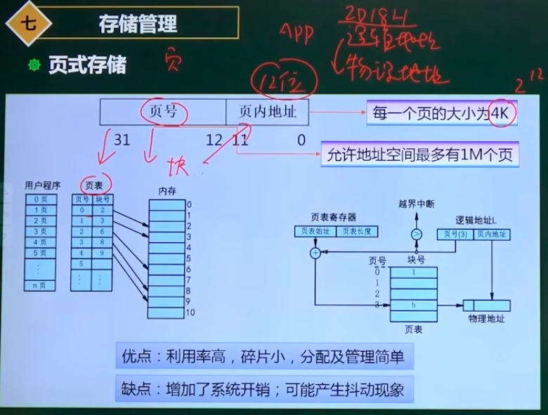
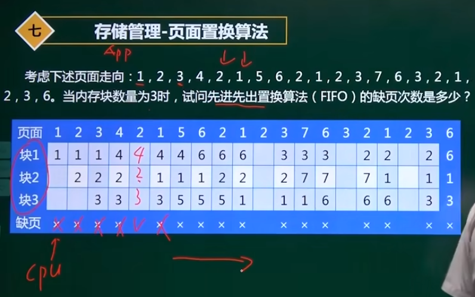

第一部分 计算机基础
-----
---

## 计算机硬件基础 3~4
### 数据的表示
**进制**  
如何表示：数字的下标或者后面加O（8进制）和H（16进制）  
**进制转化**  
2进制转10进制：按权展开，按照位数乘以相应的次方，如10100: 1x2^4+1x2^2  
10进制转2进制：反向推算，先算最高的次方，再加次高的次方。  
2进制转8进制：从右往左每三位转1位8进制，不足三位的在最左边添0补齐。  
8进制转2进制：每一位转为3位2进制。  
2进制和16进制：同上，改为4位转1位。  
10进制转为16进制：先转2进制，再转16进制。也可以直接转，不过容易出错。  
**原码、反码、补码**  
用八位2进制表示一个数，第一位为符号位，0代表正数，1代表负数。 
   
原码表示的正负数直接相加，结果不正确。    
原码表示0的两种方式：00000000 10000000   
反码：正数跟原码一样，负数保留原码的符号位，其他7位取反。    
反码表示0的两种形式：00000000 11111111   
补码：正数跟原码一样，负数保留原码的符号位，其他7位取反再+1即可转为原码。  
补码表示0只有一种形式：00000000  
定点小数：假设把小数点放到符号位后面，能表示的小数的值的范围。   
补码的定点小数可以等于-1：因为补码可以表示-128，此时数字位+符号位共9位，符号位是1，数值位的第一位是1，后面都是0，小数点在1后面（因为小数点后面的数只能7位）  

### 指令系统
**计算机结构**  

CPU包含运算器、控制器。
运算器包括：  
1. 算术逻辑单元ALU：负责算数运算和逻辑运算  
2. 累加寄存器AD：缓存中间的计算结果
3. 数据缓冲寄存器：缓存从主存储器中读取的数据
4. 状态条件寄存器：存储计算过程中的状态信息：如进位和借位，结果有溢出等等

控制器包括：
1. 程序计数器PC：存放下一条指令所在的地址，PC=PC+1（顺序执行时）
2. 指令寄存器IR：存放当前执行的执行
3. 指令译码器：对指令的操作码进行译码
4. 时序部件：为指令执行产生时序信号

总线：包括数据总线（传递数据）、地址总线（给主存储器编址并传递等）、控制总线（传递控制命令），用来串联计算机的各个部分。  

**寻址方式**  
指令由`操作码`和`地址码`组成。操作码指的是要做的操作，如加减乘除；地址码指的是对哪里的数据进行操作，也就是操作数的地址。  
寻址指的是寻找操作数的地址。  
  
寻址分为三大类：立即寻址、内存寻址（变址、直接、间接）、寄存器寻址。
1. 立即寻址：指令直接包含操作数，无需经过内存和寄存器。缺点：精度不高、数值不能过大
2. 变址寻址：用变址寄存器上面的数字加上地址码的地址，即可得到真正的内存地址。访问一次内存。4+&101=&105->270
3. 直接寻址：根据地址码上面的地址访问一次内存，&103->250
4. 间接寻址：根据地址码上面的地址访问两次内存，第一次访问的内存空间存放的也是一个内存地址，而不是操作数的地址。&102->&100->220  
5. 寄存器寻址：操作数在寄存器中
6. 寄存器间接寻址：操作数在内存中，操作数的内存地址存放在寄存器中。  
不同的寻址方式是为了满足编程的灵活度。  

**CPU指令系统之CISC和RISC**  
  
CISC是面向用户编程的指令系统，RISC是面向机器高效性的指令系统。

### 流水线
  
指令的处理分为**取指、分析、执行**三步。  
使用流水线可以让多条指令同时进行以上三步，大大提高执行效率。  
**流水线的计算**  
流水线执行时间：(t取指 + t分析 + t执行) + (n-1)tmax （n代表指令条数，tmax代表三个步骤中最耗时的时间，称为**流水线周期**。  
例：若指令流水线把一条指令分为取指、分析和执行三部分，且三部分的时间分别是取指2ns，分析2ns，执行1ns。那么，流水线周期是？100条指令全部执行完毕需要的时间就是？  
解答：流水线周期是2ns。  
执行时间：(2+2+1)+(100-1)2=203ns  
加速比： (2+2+1)100/203=2.46   
**流水线技术指标**  
吞吐率：Tp=n/Tk（指令条数100/执行的总时间203ns）  
最大吞吐率：周期的倒数 1/2ns  
加速比：S=Ts/Tk（不用流水线的时间/用流水线的时间，这里是5x100/203）   
效率：工作部件占总部件的比值，一共取指、分析、执行三个部件，所以是0，三分之一、三分之二，100%  

### CPU  
### 存储系统
   

**存储器存储方式：**  
- 顺序存取（磁带）：以线性的顺序去保存数据。
- 直接存取（硬盘）：磁头移到对应的磁道中读取扇区中的信息。
- 随机存取（内存）：在任意时刻可以对内存存储单元中的任何一个模块进行数据读取。时间跟访问序列无关。  
- 相联存取（Cache）：根据内容读，而不是根据地址读。  
**主存储器组成**
  

### Cache
   
Cache的淘汰算法：先进先出算法、最近最少使用算法、随机算法。

### 磁盘（不只上午考，下午也是核心知识点）
  

### RAID技术
[RAID磁盘阵列是什么（一看就懂）](https://zhuanlan.zhihu.com/p/51170719 )  

  
条带宽度：磁盘的个数。  
条带大小：磁盘个数乘以条带深度。  
条带深度：图中分块的大小。  
  
  
RAID0技术直接把多块磁盘串联起来，并行的写和读，速度是原来的N倍，缺点是不可靠，坏一个就坏了。
  
RAID1技术就是直接用另外一个磁盘做数据备份，双倍的读效率，写效率不变，缺点是空间利用率低。
  
  
RAID3就是用一个磁盘做校验磁盘，多倍的读写效率，但是缺点是校验磁盘有I/O瓶颈，因为其他磁盘的读写都要同步更新校验磁盘，所以校验磁盘的读写是最频繁的。   
  
RAID5采用分布式奇偶校验，把校验数据分别放在每个磁盘上面，比RAID3好，但也是只允许一个磁盘损坏。
  
  
RAID6采用两个独立分布式校验方案，也就是有两种类型的校验数据，可以允许两个磁盘损坏。  
  
RAID10结合了RAID1和RAID0的用法，先做镜像，再条带化。  
  
> 企业中用得最多的就是RAID10和RAID5

对比RAID10和RAID5的性能：  
性能：10>5  
可靠性：10>5  
recover重构：10>5  
成本：5>10（其实就是比较磁盘利用率）  
一般是关键业务用RAID10，非关键业务如灾备等用RAID5  

**RAID数据保护**  
1. 热备盘：当一块磁盘坏了的时候，其他磁盘可以马上把数据恢复到热备盘中，再等待损坏硬盘被更换。  
2. 预拷贝：通过磁盘监控技术，如果监控到某个磁盘已经出现了问题但还没有掉线，就直接拷贝该磁盘的数据到热备盘。
3. 失效重构：指磁盘损坏后如何恢复数据。
4. RAID状态：当一块磁盘坏了但是整个磁盘系统还能正常读数据的时候，状态降为降级状态；如果不能读数据，则为失效状态。  

**RAID技术发展**  
  
块虚拟化：将每个磁盘分为很多个数据块，再以数据块作为RAID阵列的成员，这个RAID阵列由所有磁盘组成，所以当一个磁盘坏了，其他所有磁盘都参与数据重构，一方有难，八方支援。  
**块虚拟化（RAID 2.0）优点：**   
1. 快速重构
2. 自动负载均衡（没有热点盘）
3. 系统性能提升
4. 自愈合（不用更换故障盘）
### 内存编址
### 可靠性
   
 串行：一个坏，就都坏，全部好，才算好。可靠性等于所有部件的可靠性相乘。  
 并行：所有都坏，才算怀，一个好，都算好。可靠性等于1减去所有部件都损坏的概率。  

## 操作系统基础 1~2
### 进程管理
进程的状态：  

  
解决死锁：死锁预防、死锁避免、死锁检测、死锁解除。  

**银行家算法：分配资源的原则**  
- 当一个进程对资源的最大需求量不超过系统中的资源数时可以接纳该进程。
- 进程可以分期请求资源，但请求的总数不能超过最大需求量。
- 当系统现有的资源不能满足进程尚需资源数时，对进程的请求可以推迟分配，但总能使进程在有限的时间里得到资源。  

举例子说明：  
  
这种题目一般就是先解决需要少量资源的，最后空出更多资源给需要大量资源的进程。  

**进程的互斥和同步**  
  
互斥：资源只能被一个进程占用。  
同步：资源可以被多个进程占用，但速度快的要等速度慢的（要一起到达终点）。  
    
信号量大于等于0时，代表进程可用的资源个数；信号量小于0时，代表等待使用该资源的进程个数。  
    

### 存储管理
[操作系统——页式存储管理](https://www.cnblogs.com/wkfvawl/p/11700301.html )  
逻辑地址= 页号 + 页内地址  
物理地址= 块号 + 页内地址
由于页面和物理块的大小相等，页内偏移地址和块内偏移地址是相同的。无须进行从页内地址到块内地址的转换。物理块号内的偏移地址就是页内偏移地址。  
  
页面置换算法：先进先出置换算法（FIFO），最佳置换算法（OPT），最近最少使用算法（LRU）。
例题是将多个页面放入三个高速块中。  
  
其实主要是的考虑淘汰哪个页：  
先进先出：很简单不用多说。  
最佳置换算法：淘汰将来经历最久后才被使用的。（需要预测将来，所以不可能被实现）  
最少使用算法：淘汰之前最久未被访问的页面。    

### 文件管理
### 设备管理

## 系统开发与项目管理基础 3~4
### 软件生命周期
### 软件开发模型
### 开发概念
### 进度管理
## 知识产权和标准化 1
### 著作权
### 保护期限
### 产权人确立
### 侵权判断
### 商标权

-----
第二部分 网络相关
-----
## 网络体系结构 2
### 网络协议
### OSI参考模型
### TCP/IP体系结构

## 数据通信基础 4~6
### 信道传输速率
### 调制与编码
### 常见复用技术和相关标准
### 差错控制
## 广域网与接入网技术 2~3
### HDLC
### PPP
### SONET/SDH
### xDSL
### HFC
### 数据交换类型
## 局域网技术 6~10
### IEEE 802标准
### 以太网技术
### 网桥
### 交换机
### 无线局域网
### VLAN
### GVRP
### STP
### 综合布线系统
### 传输介质
## 网络互联与因特网技术 20~25
### IP地址
### 子网划分
### CIDR
### IP数据报
### ARP
### ICMP
### IPv6协议
### TCP
### UDP
### QOS
### 路由基础概念
### 路由器基本配置
### RIP
### OSPF
### BGP
### ACL
### NAT
### Web
### DNS
### DHCP
### FTP
### Telnet
### 电子邮件
## 系统与网络安全基础 5~8
### 计算机病毒
### 网络攻击
### 加密算法
### 秘钥管理
### 数字签名
### 报文摘要
### 数字证书
### 入侵检测技术
### 安全协议
### VPN
### 防火墙
## 网络管理技术 5~6
### Windows/Linux网管命令
### Linux系统命令
### Linux目录结构
### Linux系统文件
### SNMP协议
### 网络管理概念
### 网络存储
### 网络故障排除
## 网络规划和设计 3
### 需求分析
### 通信规范分析
### 逻辑网络设计
### 物理网络设计

-----
第三部分 计算机专业英语
-----

## 计算机专业英语 5

